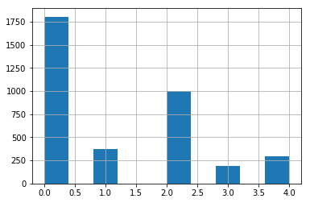
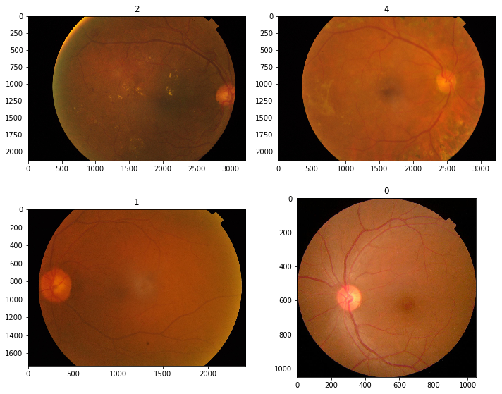
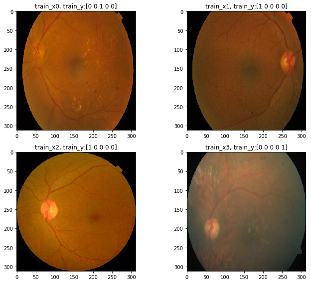
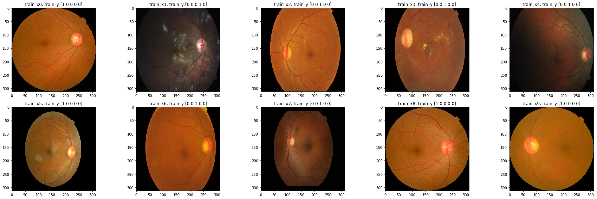
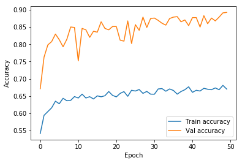
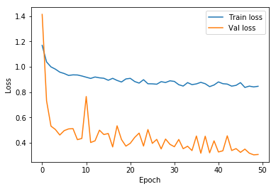

```python
# This Python 3 environment comes with many helpful analytics libraries installed
# It is defined by the kaggle/python docker image: https://github.com/kaggle/docker-python
# For example, here's several helpful packages to load in 

import numpy as np # linear algebra
import pandas as pd # data processing, CSV file I/O (e.g. pd.read_csv)

# Input data files are available in the "../input/" directory.

import os

# Any results you write to the current directory are saved as output.
```


```python
print(os.listdir("../input")) # note: the densenet-keras is added manually to implement transfer learning from densenet model
```

    ['aptos2019-blindness-detection', 'densenet-keras']
    


```python
import tensorflow as tf
from keras import layers
from sklearn.model_selection import train_test_split
from keras.callbacks import Callback
from sklearn.metrics import cohen_kappa_score, accuracy_score
from keras.callbacks import EarlyStopping

import cv2
from keras.preprocessing.image import ImageDataGenerator
from keras.applications.densenet import DenseNet121
from keras.layers import (Activation, Dropout, Dense,
                          BatchNormalization, Input, GlobalAveragePooling2D)
from keras.models import Model
from keras import metrics
from keras.optimizers import Adam 
from keras.optimizers import Nadam

from tqdm import tqdm #shows progress bar of the operation

import matplotlib.pyplot as plt
%matplotlib inline

```

    Using TensorFlow backend.
    

### Set random seed for repeatability


```python
np.random.seed(2019)
tf.set_random_seed(2019)
```

## Loading and EDA


```python
train_df = pd.read_csv('../input/aptos2019-blindness-detection/train.csv')
test_df  = pd.read_csv('../input/aptos2019-blindness-detection/test.csv')
print("train_df shape:", train_df.shape)
print("test_df shape:",test_df.shape)
train_df.head()
```

    train_df shape: (3662, 2)
    test_df shape: (1928, 1)
    


<div>
<style scoped>
    .dataframe tbody tr th:only-of-type {
        vertical-align: middle;
    }

    .dataframe tbody tr th {
        vertical-align: top;
    }

    .dataframe thead th {
        text-align: right;
    }
</style>
<table border="1" class="dataframe">
  <thead>
    <tr style="text-align: right;">
      <th></th>
      <th>id_code</th>
      <th>diagnosis</th>
    </tr>
  </thead>
  <tbody>
    <tr>
      <td>0</td>
      <td>000c1434d8d7</td>
      <td>2</td>
    </tr>
    <tr>
      <td>1</td>
      <td>001639a390f0</td>
      <td>4</td>
    </tr>
    <tr>
      <td>2</td>
      <td>0024cdab0c1e</td>
      <td>1</td>
    </tr>
    <tr>
      <td>3</td>
      <td>002c21358ce6</td>
      <td>0</td>
    </tr>
    <tr>
      <td>4</td>
      <td>005b95c28852</td>
      <td>0</td>
    </tr>
  </tbody>
</table>
</div>


```python
#lets look at data distribution
train_df['diagnosis'].hist()
train_df['diagnosis'].value_counts()
```


    0    1805
    2     999
    1     370
    4     295
    3     193
    Name: diagnosis, dtype: int64





## Display sample images


```python
# this function is modified based on this awesome kernel: https://www.kaggle.com/xhlulu/aptos-2019-densenet-keras-starter

def display_samples(df, columns=4, rows=3):
    fig=plt.figure(figsize=(5*columns, 4*rows))

    for i in range(columns*rows):
        image_path = df.loc[i,'id_code']
        image_id = df.loc[i,'diagnosis']
        img = cv2.imread(f'../input/aptos2019-blindness-detection/train_images/{image_path}.png')
        img = cv2.cvtColor(img, cv2.COLOR_BGR2RGB)
        print('size = ',img.shape)
        fig.add_subplot(rows, columns, i+1)
        plt.title(image_id)
        plt.imshow(img)
    
    plt.tight_layout()

display_samples(train_df,2,2)
```

    size =  (2136, 3216, 3)
    size =  (2136, 3216, 3)
    size =  (1736, 2416, 3)
    size =  (1050, 1050, 3)
    





## Resize Images
Resize to 312x312, then create a single numpy array to hold the data 


```python
N = train_df.shape[0]
IMG_SIZE = 312
x_train = np.zeros((N, IMG_SIZE, IMG_SIZE,3), dtype = np.uint8)

def resize_IMG(image_path, desired_size = IMG_SIZE):
    img = cv2.imread(image_path)
    im = cv2.cvtColor(img, cv2.COLOR_BGR2RGB)
    im = cv2.resize(im,(desired_size, desired_size))
    
    return im

```

## resize the train set images and store in x_train array


```python
# this function is modified based on this awesome kernel: https://www.kaggle.com/xhlulu/aptos-2019-densenet-keras-starter

for i, image_id in enumerate(tqdm(train_df['id_code'])):
    x_train[i, :, :, :] = resize_IMG(
    f'../input/aptos2019-blindness-detection/train_images/{image_id}.png')
```

    100%|██████████| 3662/3662 [04:51<00:00, 12.57it/s]
    


```python
# convert the y values to categorical values (0,1,2,3,4)
# This idea is taken from this kernel, seemed more intuitive than the previous kernel method, link: # https://www.kaggle.com/ratan123/aptos-2019-keras-baseline

y_train = tf.keras.utils.to_categorical(
    train_df['diagnosis'],
    num_classes=5,
    dtype='uint8'
)
y_train[0:5] #see the first 5 rows 
```


    array([[0, 0, 1, 0, 0],
           [0, 0, 0, 0, 1],
           [0, 1, 0, 0, 0],
           [1, 0, 0, 0, 0],
           [1, 0, 0, 0, 0]], dtype=uint8)


```python
# generate train_test split
train_x, valid_x, train_y, valid_y = train_test_split(x_train, y_train, test_size=0.20,
                                                      stratify=y_train, random_state=8)
```

# Augmenting dataset to generate more training samples to address class imbalance


```python
# # Augmenting the training set to get more training set out of it as wells as help reduce overfitting

BATCH_SIZE = 32
datagen = ImageDataGenerator(
    zoom_range = 0.15,
    width_shift_range=0.2,
    height_shift_range=0.2,
    horizontal_flip=True,
    vertical_flip=True,
    brightness_range=(-3.0,3.0),
    channel_shift_range=5.0
    )

data_generator = datagen.flow(x_train, y_train, batch_size=BATCH_SIZE, seed=2019)
```

# Optional - only for sanity check that preprocessing is done ok


```python
# lets visualize the train and test images after preprocessing and split

def display_samples_preprocess(df1,df2, columns=4, rows=3):
    fig=plt.figure(figsize=(5*columns, 4*rows))

    for i in range(columns*rows):
        train_img = df1[i] 
        fig.add_subplot(rows, columns, i+1)
        plt.title('train_x{}, train_y:{}'.format(i,df2[i]))
       
        plt.imshow(train_img)
    
    plt.tight_layout()


```


```python
display_samples_preprocess(train_x,train_y,2,2)
train_x.shape
```


    (2929, 312, 312, 3)





```python
# make sure validation sets also looks ok

display_samples_preprocess(valid_x,valid_y,5,2)
valid_x.shape
```


    (733, 312, 312, 3)





```python
# Create Callback class to implement 
# Modified quite a bit from original code: https://www.kaggle.com/xhlulu/aptos-2019-densenet-keras-starter

class Metrics(Callback):
    """ Callback class to be used to calculate validation kappa score after each epoch and save model if higher 
    value than last saved value"""
    
    def on_train_begin(self, logs={}):
        self.val_kappas = []
    

    def on_epoch_end(self, epoch, logs={}):
        X_val, y_val = self.validation_data[:2]
        y_pred = self.model.predict(X_val)
       
        def flatten(var):
            flat = []
            for row in tqdm(var):
                predict_label = np.argmax(row)
                flat.append(str(predict_label))
            return flat
        
        y_val = flatten(y_val)
        y_pred = flatten(y_pred)

        _val_kappa = cohen_kappa_score(
            y_val,
            y_pred, 
            weights='quadratic'
        )

        self.val_kappas.append(_val_kappa)

        print(f"val_kappa: {_val_kappa:.4f}")
        
        if _val_kappa >= max(self.val_kappas):
            print("Validation Kappa has improved. Saving model.")
            self.model.save('../working/model.h5')

        return
```


```python
#define the two callback functions that will be called during training
early =  EarlyStopping(monitor = "val_accuracy",
                      mode = "max",
                      patience = 20)

kappa_metrics = Metrics()
```


```python
# Define model:
# The function below is taken from this awesome kernel (only removed one dropout layer since the model seems to be already generelaizing well):
# link: https://www.kaggle.com/ratan123/aptos-2019-keras-baseline
def create_model(input_shape, n_out):
    input_tensor = Input(shape = input_shape)
    base_model = DenseNet121(include_top = False,
                            weights = None,
                            input_tensor = input_tensor)
    base_model.load_weights("../input/densenet-keras/DenseNet-BC-121-32-no-top.h5")
    x = GlobalAveragePooling2D()(base_model.output) 
    x = Dense(1024, activation = 'relu')(x)
    x = Dropout(0.5)(x)
    final_output = Dense(n_out, activation = 'softmax', name = 'final_output')(x)
    model = Model(input_tensor, final_output)
    
    return model


```


```python
# call the model:

NUM_CLASS = 5

model = create_model(
        input_shape= (IMG_SIZE, IMG_SIZE, 3),
        n_out = NUM_CLASS
                    )
model.summary()
```

    Model: "model_1"
    __________________________________________________________________________________________________
    Layer (type)                    Output Shape         Param #     Connected to                     
    ==================================================================================================
    input_1 (InputLayer)            (None, 312, 312, 3)  0                                            
    __________________________________________________________________________________________________
    zero_padding2d_1 (ZeroPadding2D (None, 318, 318, 3)  0           input_1[0][0]                    
    __________________________________________________________________________________________________
    conv1/conv (Conv2D)             (None, 156, 156, 64) 9408        zero_padding2d_1[0][0]           
    __________________________________________________________________________________________________
    conv1/bn (BatchNormalization)   (None, 156, 156, 64) 256         conv1/conv[0][0]                 
    __________________________________________________________________________________________________
    conv1/relu (Activation)         (None, 156, 156, 64) 0           conv1/bn[0][0]                   
    __________________________________________________________________________________________________
    zero_padding2d_2 (ZeroPadding2D (None, 158, 158, 64) 0           conv1/relu[0][0]                 
    __________________________________________________________________________________________________
    pool1 (MaxPooling2D)            (None, 78, 78, 64)   0           zero_padding2d_2[0][0]           
    __________________________________________________________________________________________________
    conv2_block1_0_bn (BatchNormali (None, 78, 78, 64)   256         pool1[0][0]                      
    __________________________________________________________________________________________________
    conv2_block1_0_relu (Activation (None, 78, 78, 64)   0           conv2_block1_0_bn[0][0]          
    __________________________________________________________________________________________________
    conv2_block1_1_conv (Conv2D)    (None, 78, 78, 128)  8192        conv2_block1_0_relu[0][0]        
    __________________________________________________________________________________________________
    conv2_block1_1_bn (BatchNormali (None, 78, 78, 128)  512         conv2_block1_1_conv[0][0]        
    __________________________________________________________________________________________________
    conv2_block1_1_relu (Activation (None, 78, 78, 128)  0           conv2_block1_1_bn[0][0]          
    __________________________________________________________________________________________________
    conv2_block1_2_conv (Conv2D)    (None, 78, 78, 32)   36864       conv2_block1_1_relu[0][0]        
    __________________________________________________________________________________________________
    conv2_block1_concat (Concatenat (None, 78, 78, 96)   0           pool1[0][0]                      
                                                                     conv2_block1_2_conv[0][0]        
    __________________________________________________________________________________________________
    conv2_block2_0_bn (BatchNormali (None, 78, 78, 96)   384         conv2_block1_concat[0][0]        
    __________________________________________________________________________________________________
    conv2_block2_0_relu (Activation (None, 78, 78, 96)   0           conv2_block2_0_bn[0][0]          
    __________________________________________________________________________________________________
    conv2_block2_1_conv (Conv2D)    (None, 78, 78, 128)  12288       conv2_block2_0_relu[0][0]        
    __________________________________________________________________________________________________
    conv2_block2_1_bn (BatchNormali (None, 78, 78, 128)  512         conv2_block2_1_conv[0][0]        
    __________________________________________________________________________________________________
    conv2_block2_1_relu (Activation (None, 78, 78, 128)  0           conv2_block2_1_bn[0][0]          
    __________________________________________________________________________________________________
    conv2_block2_2_conv (Conv2D)    (None, 78, 78, 32)   36864       conv2_block2_1_relu[0][0]        
    __________________________________________________________________________________________________
    conv2_block2_concat (Concatenat (None, 78, 78, 128)  0           conv2_block1_concat[0][0]        
                                                                     conv2_block2_2_conv[0][0]        
    __________________________________________________________________________________________________
    conv2_block3_0_bn (BatchNormali (None, 78, 78, 128)  512         conv2_block2_concat[0][0]        
    __________________________________________________________________________________________________
    conv2_block3_0_relu (Activation (None, 78, 78, 128)  0           conv2_block3_0_bn[0][0]          
    __________________________________________________________________________________________________
    conv2_block3_1_conv (Conv2D)    (None, 78, 78, 128)  16384       conv2_block3_0_relu[0][0]        
    __________________________________________________________________________________________________
    conv2_block3_1_bn (BatchNormali (None, 78, 78, 128)  512         conv2_block3_1_conv[0][0]        
    __________________________________________________________________________________________________
    conv2_block3_1_relu (Activation (None, 78, 78, 128)  0           conv2_block3_1_bn[0][0]          
    __________________________________________________________________________________________________
    conv2_block3_2_conv (Conv2D)    (None, 78, 78, 32)   36864       conv2_block3_1_relu[0][0]        
    __________________________________________________________________________________________________
    conv2_block3_concat (Concatenat (None, 78, 78, 160)  0           conv2_block2_concat[0][0]        
                                                                     conv2_block3_2_conv[0][0]        
    __________________________________________________________________________________________________
    conv2_block4_0_bn (BatchNormali (None, 78, 78, 160)  640         conv2_block3_concat[0][0]        
    __________________________________________________________________________________________________
    conv2_block4_0_relu (Activation (None, 78, 78, 160)  0           conv2_block4_0_bn[0][0]          
    __________________________________________________________________________________________________
    conv2_block4_1_conv (Conv2D)    (None, 78, 78, 128)  20480       conv2_block4_0_relu[0][0]        
    __________________________________________________________________________________________________
    conv2_block4_1_bn (BatchNormali (None, 78, 78, 128)  512         conv2_block4_1_conv[0][0]        
    __________________________________________________________________________________________________
    conv2_block4_1_relu (Activation (None, 78, 78, 128)  0           conv2_block4_1_bn[0][0]          
    __________________________________________________________________________________________________
    conv2_block4_2_conv (Conv2D)    (None, 78, 78, 32)   36864       conv2_block4_1_relu[0][0]        
    __________________________________________________________________________________________________
    conv2_block4_concat (Concatenat (None, 78, 78, 192)  0           conv2_block3_concat[0][0]        
                                                                     conv2_block4_2_conv[0][0]        
    __________________________________________________________________________________________________
    conv2_block5_0_bn (BatchNormali (None, 78, 78, 192)  768         conv2_block4_concat[0][0]        
    __________________________________________________________________________________________________
    conv2_block5_0_relu (Activation (None, 78, 78, 192)  0           conv2_block5_0_bn[0][0]          
    __________________________________________________________________________________________________
    conv2_block5_1_conv (Conv2D)    (None, 78, 78, 128)  24576       conv2_block5_0_relu[0][0]        
    __________________________________________________________________________________________________
    conv2_block5_1_bn (BatchNormali (None, 78, 78, 128)  512         conv2_block5_1_conv[0][0]        
    __________________________________________________________________________________________________
    conv2_block5_1_relu (Activation (None, 78, 78, 128)  0           conv2_block5_1_bn[0][0]          
    __________________________________________________________________________________________________
    conv2_block5_2_conv (Conv2D)    (None, 78, 78, 32)   36864       conv2_block5_1_relu[0][0]        
    __________________________________________________________________________________________________
    conv2_block5_concat (Concatenat (None, 78, 78, 224)  0           conv2_block4_concat[0][0]        
                                                                     conv2_block5_2_conv[0][0]        
    __________________________________________________________________________________________________
    conv2_block6_0_bn (BatchNormali (None, 78, 78, 224)  896         conv2_block5_concat[0][0]        
    __________________________________________________________________________________________________
    conv2_block6_0_relu (Activation (None, 78, 78, 224)  0           conv2_block6_0_bn[0][0]          
    __________________________________________________________________________________________________
    conv2_block6_1_conv (Conv2D)    (None, 78, 78, 128)  28672       conv2_block6_0_relu[0][0]        
    __________________________________________________________________________________________________
    conv2_block6_1_bn (BatchNormali (None, 78, 78, 128)  512         conv2_block6_1_conv[0][0]        
    __________________________________________________________________________________________________
    conv2_block6_1_relu (Activation (None, 78, 78, 128)  0           conv2_block6_1_bn[0][0]          
    __________________________________________________________________________________________________
    conv2_block6_2_conv (Conv2D)    (None, 78, 78, 32)   36864       conv2_block6_1_relu[0][0]        
    __________________________________________________________________________________________________
    conv2_block6_concat (Concatenat (None, 78, 78, 256)  0           conv2_block5_concat[0][0]        
                                                                     conv2_block6_2_conv[0][0]        
    __________________________________________________________________________________________________
    pool2_bn (BatchNormalization)   (None, 78, 78, 256)  1024        conv2_block6_concat[0][0]        
    __________________________________________________________________________________________________
    pool2_relu (Activation)         (None, 78, 78, 256)  0           pool2_bn[0][0]                   
    __________________________________________________________________________________________________
    pool2_conv (Conv2D)             (None, 78, 78, 128)  32768       pool2_relu[0][0]                 
    __________________________________________________________________________________________________
    pool2_pool (AveragePooling2D)   (None, 39, 39, 128)  0           pool2_conv[0][0]                 
    __________________________________________________________________________________________________
    conv3_block1_0_bn (BatchNormali (None, 39, 39, 128)  512         pool2_pool[0][0]                 
    __________________________________________________________________________________________________
    conv3_block1_0_relu (Activation (None, 39, 39, 128)  0           conv3_block1_0_bn[0][0]          
    __________________________________________________________________________________________________
    conv3_block1_1_conv (Conv2D)    (None, 39, 39, 128)  16384       conv3_block1_0_relu[0][0]        
    __________________________________________________________________________________________________
    conv3_block1_1_bn (BatchNormali (None, 39, 39, 128)  512         conv3_block1_1_conv[0][0]        
    __________________________________________________________________________________________________
    conv3_block1_1_relu (Activation (None, 39, 39, 128)  0           conv3_block1_1_bn[0][0]          
    __________________________________________________________________________________________________
    conv3_block1_2_conv (Conv2D)    (None, 39, 39, 32)   36864       conv3_block1_1_relu[0][0]        
    __________________________________________________________________________________________________
    conv3_block1_concat (Concatenat (None, 39, 39, 160)  0           pool2_pool[0][0]                 
                                                                     conv3_block1_2_conv[0][0]        
    __________________________________________________________________________________________________
    conv3_block2_0_bn (BatchNormali (None, 39, 39, 160)  640         conv3_block1_concat[0][0]        
    __________________________________________________________________________________________________
    conv3_block2_0_relu (Activation (None, 39, 39, 160)  0           conv3_block2_0_bn[0][0]          
    __________________________________________________________________________________________________
    conv3_block2_1_conv (Conv2D)    (None, 39, 39, 128)  20480       conv3_block2_0_relu[0][0]        
    __________________________________________________________________________________________________
    conv3_block2_1_bn (BatchNormali (None, 39, 39, 128)  512         conv3_block2_1_conv[0][0]        
    __________________________________________________________________________________________________
    conv3_block2_1_relu (Activation (None, 39, 39, 128)  0           conv3_block2_1_bn[0][0]          
    __________________________________________________________________________________________________
    conv3_block2_2_conv (Conv2D)    (None, 39, 39, 32)   36864       conv3_block2_1_relu[0][0]        
    __________________________________________________________________________________________________
    conv3_block2_concat (Concatenat (None, 39, 39, 192)  0           conv3_block1_concat[0][0]        
                                                                     conv3_block2_2_conv[0][0]        
    __________________________________________________________________________________________________
    conv3_block3_0_bn (BatchNormali (None, 39, 39, 192)  768         conv3_block2_concat[0][0]        
    __________________________________________________________________________________________________
    conv3_block3_0_relu (Activation (None, 39, 39, 192)  0           conv3_block3_0_bn[0][0]          
    __________________________________________________________________________________________________
    conv3_block3_1_conv (Conv2D)    (None, 39, 39, 128)  24576       conv3_block3_0_relu[0][0]        
    __________________________________________________________________________________________________
    conv3_block3_1_bn (BatchNormali (None, 39, 39, 128)  512         conv3_block3_1_conv[0][0]        
    __________________________________________________________________________________________________
    conv3_block3_1_relu (Activation (None, 39, 39, 128)  0           conv3_block3_1_bn[0][0]          
    __________________________________________________________________________________________________
    conv3_block3_2_conv (Conv2D)    (None, 39, 39, 32)   36864       conv3_block3_1_relu[0][0]        
    __________________________________________________________________________________________________
    conv3_block3_concat (Concatenat (None, 39, 39, 224)  0           conv3_block2_concat[0][0]        
                                                                     conv3_block3_2_conv[0][0]        
    __________________________________________________________________________________________________
    conv3_block4_0_bn (BatchNormali (None, 39, 39, 224)  896         conv3_block3_concat[0][0]        
    __________________________________________________________________________________________________
    conv3_block4_0_relu (Activation (None, 39, 39, 224)  0           conv3_block4_0_bn[0][0]          
    __________________________________________________________________________________________________
    conv3_block4_1_conv (Conv2D)    (None, 39, 39, 128)  28672       conv3_block4_0_relu[0][0]        
    __________________________________________________________________________________________________
    conv3_block4_1_bn (BatchNormali (None, 39, 39, 128)  512         conv3_block4_1_conv[0][0]        
    __________________________________________________________________________________________________
    conv3_block4_1_relu (Activation (None, 39, 39, 128)  0           conv3_block4_1_bn[0][0]          
    __________________________________________________________________________________________________
    conv3_block4_2_conv (Conv2D)    (None, 39, 39, 32)   36864       conv3_block4_1_relu[0][0]        
    __________________________________________________________________________________________________
    conv3_block4_concat (Concatenat (None, 39, 39, 256)  0           conv3_block3_concat[0][0]        
                                                                     conv3_block4_2_conv[0][0]        
    __________________________________________________________________________________________________
    conv3_block5_0_bn (BatchNormali (None, 39, 39, 256)  1024        conv3_block4_concat[0][0]        
    __________________________________________________________________________________________________
    conv3_block5_0_relu (Activation (None, 39, 39, 256)  0           conv3_block5_0_bn[0][0]          
    __________________________________________________________________________________________________
    conv3_block5_1_conv (Conv2D)    (None, 39, 39, 128)  32768       conv3_block5_0_relu[0][0]        
    __________________________________________________________________________________________________
    conv3_block5_1_bn (BatchNormali (None, 39, 39, 128)  512         conv3_block5_1_conv[0][0]        
    __________________________________________________________________________________________________
    conv3_block5_1_relu (Activation (None, 39, 39, 128)  0           conv3_block5_1_bn[0][0]          
    __________________________________________________________________________________________________
    conv3_block5_2_conv (Conv2D)    (None, 39, 39, 32)   36864       conv3_block5_1_relu[0][0]        
    __________________________________________________________________________________________________
    conv3_block5_concat (Concatenat (None, 39, 39, 288)  0           conv3_block4_concat[0][0]        
                                                                     conv3_block5_2_conv[0][0]        
    __________________________________________________________________________________________________
    conv3_block6_0_bn (BatchNormali (None, 39, 39, 288)  1152        conv3_block5_concat[0][0]        
    __________________________________________________________________________________________________
    conv3_block6_0_relu (Activation (None, 39, 39, 288)  0           conv3_block6_0_bn[0][0]          
    __________________________________________________________________________________________________
    conv3_block6_1_conv (Conv2D)    (None, 39, 39, 128)  36864       conv3_block6_0_relu[0][0]        
    __________________________________________________________________________________________________
    conv3_block6_1_bn (BatchNormali (None, 39, 39, 128)  512         conv3_block6_1_conv[0][0]        
    __________________________________________________________________________________________________
    conv3_block6_1_relu (Activation (None, 39, 39, 128)  0           conv3_block6_1_bn[0][0]          
    __________________________________________________________________________________________________
    conv3_block6_2_conv (Conv2D)    (None, 39, 39, 32)   36864       conv3_block6_1_relu[0][0]        
    __________________________________________________________________________________________________
    conv3_block6_concat (Concatenat (None, 39, 39, 320)  0           conv3_block5_concat[0][0]        
                                                                     conv3_block6_2_conv[0][0]        
    __________________________________________________________________________________________________
    conv3_block7_0_bn (BatchNormali (None, 39, 39, 320)  1280        conv3_block6_concat[0][0]        
    __________________________________________________________________________________________________
    conv3_block7_0_relu (Activation (None, 39, 39, 320)  0           conv3_block7_0_bn[0][0]          
    __________________________________________________________________________________________________
    conv3_block7_1_conv (Conv2D)    (None, 39, 39, 128)  40960       conv3_block7_0_relu[0][0]        
    __________________________________________________________________________________________________
    conv3_block7_1_bn (BatchNormali (None, 39, 39, 128)  512         conv3_block7_1_conv[0][0]        
    __________________________________________________________________________________________________
    conv3_block7_1_relu (Activation (None, 39, 39, 128)  0           conv3_block7_1_bn[0][0]          
    __________________________________________________________________________________________________
    conv3_block7_2_conv (Conv2D)    (None, 39, 39, 32)   36864       conv3_block7_1_relu[0][0]        
    __________________________________________________________________________________________________
    conv3_block7_concat (Concatenat (None, 39, 39, 352)  0           conv3_block6_concat[0][0]        
                                                                     conv3_block7_2_conv[0][0]        
    __________________________________________________________________________________________________
    conv3_block8_0_bn (BatchNormali (None, 39, 39, 352)  1408        conv3_block7_concat[0][0]        
    __________________________________________________________________________________________________
    conv3_block8_0_relu (Activation (None, 39, 39, 352)  0           conv3_block8_0_bn[0][0]          
    __________________________________________________________________________________________________
    conv3_block8_1_conv (Conv2D)    (None, 39, 39, 128)  45056       conv3_block8_0_relu[0][0]        
    __________________________________________________________________________________________________
    conv3_block8_1_bn (BatchNormali (None, 39, 39, 128)  512         conv3_block8_1_conv[0][0]        
    __________________________________________________________________________________________________
    conv3_block8_1_relu (Activation (None, 39, 39, 128)  0           conv3_block8_1_bn[0][0]          
    __________________________________________________________________________________________________
    conv3_block8_2_conv (Conv2D)    (None, 39, 39, 32)   36864       conv3_block8_1_relu[0][0]        
    __________________________________________________________________________________________________
    conv3_block8_concat (Concatenat (None, 39, 39, 384)  0           conv3_block7_concat[0][0]        
                                                                     conv3_block8_2_conv[0][0]        
    __________________________________________________________________________________________________
    conv3_block9_0_bn (BatchNormali (None, 39, 39, 384)  1536        conv3_block8_concat[0][0]        
    __________________________________________________________________________________________________
    conv3_block9_0_relu (Activation (None, 39, 39, 384)  0           conv3_block9_0_bn[0][0]          
    __________________________________________________________________________________________________
    conv3_block9_1_conv (Conv2D)    (None, 39, 39, 128)  49152       conv3_block9_0_relu[0][0]        
    __________________________________________________________________________________________________
    conv3_block9_1_bn (BatchNormali (None, 39, 39, 128)  512         conv3_block9_1_conv[0][0]        
    __________________________________________________________________________________________________
    conv3_block9_1_relu (Activation (None, 39, 39, 128)  0           conv3_block9_1_bn[0][0]          
    __________________________________________________________________________________________________
    conv3_block9_2_conv (Conv2D)    (None, 39, 39, 32)   36864       conv3_block9_1_relu[0][0]        
    __________________________________________________________________________________________________
    conv3_block9_concat (Concatenat (None, 39, 39, 416)  0           conv3_block8_concat[0][0]        
                                                                     conv3_block9_2_conv[0][0]        
    __________________________________________________________________________________________________
    conv3_block10_0_bn (BatchNormal (None, 39, 39, 416)  1664        conv3_block9_concat[0][0]        
    __________________________________________________________________________________________________
    conv3_block10_0_relu (Activatio (None, 39, 39, 416)  0           conv3_block10_0_bn[0][0]         
    __________________________________________________________________________________________________
    conv3_block10_1_conv (Conv2D)   (None, 39, 39, 128)  53248       conv3_block10_0_relu[0][0]       
    __________________________________________________________________________________________________
    conv3_block10_1_bn (BatchNormal (None, 39, 39, 128)  512         conv3_block10_1_conv[0][0]       
    __________________________________________________________________________________________________
    conv3_block10_1_relu (Activatio (None, 39, 39, 128)  0           conv3_block10_1_bn[0][0]         
    __________________________________________________________________________________________________
    conv3_block10_2_conv (Conv2D)   (None, 39, 39, 32)   36864       conv3_block10_1_relu[0][0]       
    __________________________________________________________________________________________________
    conv3_block10_concat (Concatena (None, 39, 39, 448)  0           conv3_block9_concat[0][0]        
                                                                     conv3_block10_2_conv[0][0]       
    __________________________________________________________________________________________________
    conv3_block11_0_bn (BatchNormal (None, 39, 39, 448)  1792        conv3_block10_concat[0][0]       
    __________________________________________________________________________________________________
    conv3_block11_0_relu (Activatio (None, 39, 39, 448)  0           conv3_block11_0_bn[0][0]         
    __________________________________________________________________________________________________
    conv3_block11_1_conv (Conv2D)   (None, 39, 39, 128)  57344       conv3_block11_0_relu[0][0]       
    __________________________________________________________________________________________________
    conv3_block11_1_bn (BatchNormal (None, 39, 39, 128)  512         conv3_block11_1_conv[0][0]       
    __________________________________________________________________________________________________
    conv3_block11_1_relu (Activatio (None, 39, 39, 128)  0           conv3_block11_1_bn[0][0]         
    __________________________________________________________________________________________________
    conv3_block11_2_conv (Conv2D)   (None, 39, 39, 32)   36864       conv3_block11_1_relu[0][0]       
    __________________________________________________________________________________________________
    conv3_block11_concat (Concatena (None, 39, 39, 480)  0           conv3_block10_concat[0][0]       
                                                                     conv3_block11_2_conv[0][0]       
    __________________________________________________________________________________________________
    conv3_block12_0_bn (BatchNormal (None, 39, 39, 480)  1920        conv3_block11_concat[0][0]       
    __________________________________________________________________________________________________
    conv3_block12_0_relu (Activatio (None, 39, 39, 480)  0           conv3_block12_0_bn[0][0]         
    __________________________________________________________________________________________________
    conv3_block12_1_conv (Conv2D)   (None, 39, 39, 128)  61440       conv3_block12_0_relu[0][0]       
    __________________________________________________________________________________________________
    conv3_block12_1_bn (BatchNormal (None, 39, 39, 128)  512         conv3_block12_1_conv[0][0]       
    __________________________________________________________________________________________________
    conv3_block12_1_relu (Activatio (None, 39, 39, 128)  0           conv3_block12_1_bn[0][0]         
    __________________________________________________________________________________________________
    conv3_block12_2_conv (Conv2D)   (None, 39, 39, 32)   36864       conv3_block12_1_relu[0][0]       
    __________________________________________________________________________________________________
    conv3_block12_concat (Concatena (None, 39, 39, 512)  0           conv3_block11_concat[0][0]       
                                                                     conv3_block12_2_conv[0][0]       
    __________________________________________________________________________________________________
    pool3_bn (BatchNormalization)   (None, 39, 39, 512)  2048        conv3_block12_concat[0][0]       
    __________________________________________________________________________________________________
    pool3_relu (Activation)         (None, 39, 39, 512)  0           pool3_bn[0][0]                   
    __________________________________________________________________________________________________
    pool3_conv (Conv2D)             (None, 39, 39, 256)  131072      pool3_relu[0][0]                 
    __________________________________________________________________________________________________
    pool3_pool (AveragePooling2D)   (None, 19, 19, 256)  0           pool3_conv[0][0]                 
    __________________________________________________________________________________________________
    conv4_block1_0_bn (BatchNormali (None, 19, 19, 256)  1024        pool3_pool[0][0]                 
    __________________________________________________________________________________________________
    conv4_block1_0_relu (Activation (None, 19, 19, 256)  0           conv4_block1_0_bn[0][0]          
    __________________________________________________________________________________________________
    conv4_block1_1_conv (Conv2D)    (None, 19, 19, 128)  32768       conv4_block1_0_relu[0][0]        
    __________________________________________________________________________________________________
    conv4_block1_1_bn (BatchNormali (None, 19, 19, 128)  512         conv4_block1_1_conv[0][0]        
    __________________________________________________________________________________________________
    conv4_block1_1_relu (Activation (None, 19, 19, 128)  0           conv4_block1_1_bn[0][0]          
    __________________________________________________________________________________________________
    conv4_block1_2_conv (Conv2D)    (None, 19, 19, 32)   36864       conv4_block1_1_relu[0][0]        
    __________________________________________________________________________________________________
    conv4_block1_concat (Concatenat (None, 19, 19, 288)  0           pool3_pool[0][0]                 
                                                                     conv4_block1_2_conv[0][0]        
    __________________________________________________________________________________________________
    conv4_block2_0_bn (BatchNormali (None, 19, 19, 288)  1152        conv4_block1_concat[0][0]        
    __________________________________________________________________________________________________
    conv4_block2_0_relu (Activation (None, 19, 19, 288)  0           conv4_block2_0_bn[0][0]          
    __________________________________________________________________________________________________
    conv4_block2_1_conv (Conv2D)    (None, 19, 19, 128)  36864       conv4_block2_0_relu[0][0]        
    __________________________________________________________________________________________________
    conv4_block2_1_bn (BatchNormali (None, 19, 19, 128)  512         conv4_block2_1_conv[0][0]        
    __________________________________________________________________________________________________
    conv4_block2_1_relu (Activation (None, 19, 19, 128)  0           conv4_block2_1_bn[0][0]          
    __________________________________________________________________________________________________
    conv4_block2_2_conv (Conv2D)    (None, 19, 19, 32)   36864       conv4_block2_1_relu[0][0]        
    __________________________________________________________________________________________________
    conv4_block2_concat (Concatenat (None, 19, 19, 320)  0           conv4_block1_concat[0][0]        
                                                                     conv4_block2_2_conv[0][0]        
    __________________________________________________________________________________________________
    conv4_block3_0_bn (BatchNormali (None, 19, 19, 320)  1280        conv4_block2_concat[0][0]        
    __________________________________________________________________________________________________
    conv4_block3_0_relu (Activation (None, 19, 19, 320)  0           conv4_block3_0_bn[0][0]          
    __________________________________________________________________________________________________
    conv4_block3_1_conv (Conv2D)    (None, 19, 19, 128)  40960       conv4_block3_0_relu[0][0]        
    __________________________________________________________________________________________________
    conv4_block3_1_bn (BatchNormali (None, 19, 19, 128)  512         conv4_block3_1_conv[0][0]        
    __________________________________________________________________________________________________
    conv4_block3_1_relu (Activation (None, 19, 19, 128)  0           conv4_block3_1_bn[0][0]          
    __________________________________________________________________________________________________
    conv4_block3_2_conv (Conv2D)    (None, 19, 19, 32)   36864       conv4_block3_1_relu[0][0]        
    __________________________________________________________________________________________________
    conv4_block3_concat (Concatenat (None, 19, 19, 352)  0           conv4_block2_concat[0][0]        
                                                                     conv4_block3_2_conv[0][0]        
    __________________________________________________________________________________________________
    conv4_block4_0_bn (BatchNormali (None, 19, 19, 352)  1408        conv4_block3_concat[0][0]        
    __________________________________________________________________________________________________
    conv4_block4_0_relu (Activation (None, 19, 19, 352)  0           conv4_block4_0_bn[0][0]          
    __________________________________________________________________________________________________
    conv4_block4_1_conv (Conv2D)    (None, 19, 19, 128)  45056       conv4_block4_0_relu[0][0]        
    __________________________________________________________________________________________________
    conv4_block4_1_bn (BatchNormali (None, 19, 19, 128)  512         conv4_block4_1_conv[0][0]        
    __________________________________________________________________________________________________
    conv4_block4_1_relu (Activation (None, 19, 19, 128)  0           conv4_block4_1_bn[0][0]          
    __________________________________________________________________________________________________
    conv4_block4_2_conv (Conv2D)    (None, 19, 19, 32)   36864       conv4_block4_1_relu[0][0]        
    __________________________________________________________________________________________________
    conv4_block4_concat (Concatenat (None, 19, 19, 384)  0           conv4_block3_concat[0][0]        
                                                                     conv4_block4_2_conv[0][0]        
    __________________________________________________________________________________________________
    conv4_block5_0_bn (BatchNormali (None, 19, 19, 384)  1536        conv4_block4_concat[0][0]        
    __________________________________________________________________________________________________
    conv4_block5_0_relu (Activation (None, 19, 19, 384)  0           conv4_block5_0_bn[0][0]          
    __________________________________________________________________________________________________
    conv4_block5_1_conv (Conv2D)    (None, 19, 19, 128)  49152       conv4_block5_0_relu[0][0]        
    __________________________________________________________________________________________________
    conv4_block5_1_bn (BatchNormali (None, 19, 19, 128)  512         conv4_block5_1_conv[0][0]        
    __________________________________________________________________________________________________
    conv4_block5_1_relu (Activation (None, 19, 19, 128)  0           conv4_block5_1_bn[0][0]          
    __________________________________________________________________________________________________
    conv4_block5_2_conv (Conv2D)    (None, 19, 19, 32)   36864       conv4_block5_1_relu[0][0]        
    __________________________________________________________________________________________________
    conv4_block5_concat (Concatenat (None, 19, 19, 416)  0           conv4_block4_concat[0][0]        
                                                                     conv4_block5_2_conv[0][0]        
    __________________________________________________________________________________________________
    conv4_block6_0_bn (BatchNormali (None, 19, 19, 416)  1664        conv4_block5_concat[0][0]        
    __________________________________________________________________________________________________
    conv4_block6_0_relu (Activation (None, 19, 19, 416)  0           conv4_block6_0_bn[0][0]          
    __________________________________________________________________________________________________
    conv4_block6_1_conv (Conv2D)    (None, 19, 19, 128)  53248       conv4_block6_0_relu[0][0]        
    __________________________________________________________________________________________________
    conv4_block6_1_bn (BatchNormali (None, 19, 19, 128)  512         conv4_block6_1_conv[0][0]        
    __________________________________________________________________________________________________
    conv4_block6_1_relu (Activation (None, 19, 19, 128)  0           conv4_block6_1_bn[0][0]          
    __________________________________________________________________________________________________
    conv4_block6_2_conv (Conv2D)    (None, 19, 19, 32)   36864       conv4_block6_1_relu[0][0]        
    __________________________________________________________________________________________________
    conv4_block6_concat (Concatenat (None, 19, 19, 448)  0           conv4_block5_concat[0][0]        
                                                                     conv4_block6_2_conv[0][0]        
    __________________________________________________________________________________________________
    conv4_block7_0_bn (BatchNormali (None, 19, 19, 448)  1792        conv4_block6_concat[0][0]        
    __________________________________________________________________________________________________
    conv4_block7_0_relu (Activation (None, 19, 19, 448)  0           conv4_block7_0_bn[0][0]          
    __________________________________________________________________________________________________
    conv4_block7_1_conv (Conv2D)    (None, 19, 19, 128)  57344       conv4_block7_0_relu[0][0]        
    __________________________________________________________________________________________________
    conv4_block7_1_bn (BatchNormali (None, 19, 19, 128)  512         conv4_block7_1_conv[0][0]        
    __________________________________________________________________________________________________
    conv4_block7_1_relu (Activation (None, 19, 19, 128)  0           conv4_block7_1_bn[0][0]          
    __________________________________________________________________________________________________
    conv4_block7_2_conv (Conv2D)    (None, 19, 19, 32)   36864       conv4_block7_1_relu[0][0]        
    __________________________________________________________________________________________________
    conv4_block7_concat (Concatenat (None, 19, 19, 480)  0           conv4_block6_concat[0][0]        
                                                                     conv4_block7_2_conv[0][0]        
    __________________________________________________________________________________________________
    conv4_block8_0_bn (BatchNormali (None, 19, 19, 480)  1920        conv4_block7_concat[0][0]        
    __________________________________________________________________________________________________
    conv4_block8_0_relu (Activation (None, 19, 19, 480)  0           conv4_block8_0_bn[0][0]          
    __________________________________________________________________________________________________
    conv4_block8_1_conv (Conv2D)    (None, 19, 19, 128)  61440       conv4_block8_0_relu[0][0]        
    __________________________________________________________________________________________________
    conv4_block8_1_bn (BatchNormali (None, 19, 19, 128)  512         conv4_block8_1_conv[0][0]        
    __________________________________________________________________________________________________
    conv4_block8_1_relu (Activation (None, 19, 19, 128)  0           conv4_block8_1_bn[0][0]          
    __________________________________________________________________________________________________
    conv4_block8_2_conv (Conv2D)    (None, 19, 19, 32)   36864       conv4_block8_1_relu[0][0]        
    __________________________________________________________________________________________________
    conv4_block8_concat (Concatenat (None, 19, 19, 512)  0           conv4_block7_concat[0][0]        
                                                                     conv4_block8_2_conv[0][0]        
    __________________________________________________________________________________________________
    conv4_block9_0_bn (BatchNormali (None, 19, 19, 512)  2048        conv4_block8_concat[0][0]        
    __________________________________________________________________________________________________
    conv4_block9_0_relu (Activation (None, 19, 19, 512)  0           conv4_block9_0_bn[0][0]          
    __________________________________________________________________________________________________
    conv4_block9_1_conv (Conv2D)    (None, 19, 19, 128)  65536       conv4_block9_0_relu[0][0]        
    __________________________________________________________________________________________________
    conv4_block9_1_bn (BatchNormali (None, 19, 19, 128)  512         conv4_block9_1_conv[0][0]        
    __________________________________________________________________________________________________
    conv4_block9_1_relu (Activation (None, 19, 19, 128)  0           conv4_block9_1_bn[0][0]          
    __________________________________________________________________________________________________
    conv4_block9_2_conv (Conv2D)    (None, 19, 19, 32)   36864       conv4_block9_1_relu[0][0]        
    __________________________________________________________________________________________________
    conv4_block9_concat (Concatenat (None, 19, 19, 544)  0           conv4_block8_concat[0][0]        
                                                                     conv4_block9_2_conv[0][0]        
    __________________________________________________________________________________________________
    conv4_block10_0_bn (BatchNormal (None, 19, 19, 544)  2176        conv4_block9_concat[0][0]        
    __________________________________________________________________________________________________
    conv4_block10_0_relu (Activatio (None, 19, 19, 544)  0           conv4_block10_0_bn[0][0]         
    __________________________________________________________________________________________________
    conv4_block10_1_conv (Conv2D)   (None, 19, 19, 128)  69632       conv4_block10_0_relu[0][0]       
    __________________________________________________________________________________________________
    conv4_block10_1_bn (BatchNormal (None, 19, 19, 128)  512         conv4_block10_1_conv[0][0]       
    __________________________________________________________________________________________________
    conv4_block10_1_relu (Activatio (None, 19, 19, 128)  0           conv4_block10_1_bn[0][0]         
    __________________________________________________________________________________________________
    conv4_block10_2_conv (Conv2D)   (None, 19, 19, 32)   36864       conv4_block10_1_relu[0][0]       
    __________________________________________________________________________________________________
    conv4_block10_concat (Concatena (None, 19, 19, 576)  0           conv4_block9_concat[0][0]        
                                                                     conv4_block10_2_conv[0][0]       
    __________________________________________________________________________________________________
    conv4_block11_0_bn (BatchNormal (None, 19, 19, 576)  2304        conv4_block10_concat[0][0]       
    __________________________________________________________________________________________________
    conv4_block11_0_relu (Activatio (None, 19, 19, 576)  0           conv4_block11_0_bn[0][0]         
    __________________________________________________________________________________________________
    conv4_block11_1_conv (Conv2D)   (None, 19, 19, 128)  73728       conv4_block11_0_relu[0][0]       
    __________________________________________________________________________________________________
    conv4_block11_1_bn (BatchNormal (None, 19, 19, 128)  512         conv4_block11_1_conv[0][0]       
    __________________________________________________________________________________________________
    conv4_block11_1_relu (Activatio (None, 19, 19, 128)  0           conv4_block11_1_bn[0][0]         
    __________________________________________________________________________________________________
    conv4_block11_2_conv (Conv2D)   (None, 19, 19, 32)   36864       conv4_block11_1_relu[0][0]       
    __________________________________________________________________________________________________
    conv4_block11_concat (Concatena (None, 19, 19, 608)  0           conv4_block10_concat[0][0]       
                                                                     conv4_block11_2_conv[0][0]       
    __________________________________________________________________________________________________
    conv4_block12_0_bn (BatchNormal (None, 19, 19, 608)  2432        conv4_block11_concat[0][0]       
    __________________________________________________________________________________________________
    conv4_block12_0_relu (Activatio (None, 19, 19, 608)  0           conv4_block12_0_bn[0][0]         
    __________________________________________________________________________________________________
    conv4_block12_1_conv (Conv2D)   (None, 19, 19, 128)  77824       conv4_block12_0_relu[0][0]       
    __________________________________________________________________________________________________
    conv4_block12_1_bn (BatchNormal (None, 19, 19, 128)  512         conv4_block12_1_conv[0][0]       
    __________________________________________________________________________________________________
    conv4_block12_1_relu (Activatio (None, 19, 19, 128)  0           conv4_block12_1_bn[0][0]         
    __________________________________________________________________________________________________
    conv4_block12_2_conv (Conv2D)   (None, 19, 19, 32)   36864       conv4_block12_1_relu[0][0]       
    __________________________________________________________________________________________________
    conv4_block12_concat (Concatena (None, 19, 19, 640)  0           conv4_block11_concat[0][0]       
                                                                     conv4_block12_2_conv[0][0]       
    __________________________________________________________________________________________________
    conv4_block13_0_bn (BatchNormal (None, 19, 19, 640)  2560        conv4_block12_concat[0][0]       
    __________________________________________________________________________________________________
    conv4_block13_0_relu (Activatio (None, 19, 19, 640)  0           conv4_block13_0_bn[0][0]         
    __________________________________________________________________________________________________
    conv4_block13_1_conv (Conv2D)   (None, 19, 19, 128)  81920       conv4_block13_0_relu[0][0]       
    __________________________________________________________________________________________________
    conv4_block13_1_bn (BatchNormal (None, 19, 19, 128)  512         conv4_block13_1_conv[0][0]       
    __________________________________________________________________________________________________
    conv4_block13_1_relu (Activatio (None, 19, 19, 128)  0           conv4_block13_1_bn[0][0]         
    __________________________________________________________________________________________________
    conv4_block13_2_conv (Conv2D)   (None, 19, 19, 32)   36864       conv4_block13_1_relu[0][0]       
    __________________________________________________________________________________________________
    conv4_block13_concat (Concatena (None, 19, 19, 672)  0           conv4_block12_concat[0][0]       
                                                                     conv4_block13_2_conv[0][0]       
    __________________________________________________________________________________________________
    conv4_block14_0_bn (BatchNormal (None, 19, 19, 672)  2688        conv4_block13_concat[0][0]       
    __________________________________________________________________________________________________
    conv4_block14_0_relu (Activatio (None, 19, 19, 672)  0           conv4_block14_0_bn[0][0]         
    __________________________________________________________________________________________________
    conv4_block14_1_conv (Conv2D)   (None, 19, 19, 128)  86016       conv4_block14_0_relu[0][0]       
    __________________________________________________________________________________________________
    conv4_block14_1_bn (BatchNormal (None, 19, 19, 128)  512         conv4_block14_1_conv[0][0]       
    __________________________________________________________________________________________________
    conv4_block14_1_relu (Activatio (None, 19, 19, 128)  0           conv4_block14_1_bn[0][0]         
    __________________________________________________________________________________________________
    conv4_block14_2_conv (Conv2D)   (None, 19, 19, 32)   36864       conv4_block14_1_relu[0][0]       
    __________________________________________________________________________________________________
    conv4_block14_concat (Concatena (None, 19, 19, 704)  0           conv4_block13_concat[0][0]       
                                                                     conv4_block14_2_conv[0][0]       
    __________________________________________________________________________________________________
    conv4_block15_0_bn (BatchNormal (None, 19, 19, 704)  2816        conv4_block14_concat[0][0]       
    __________________________________________________________________________________________________
    conv4_block15_0_relu (Activatio (None, 19, 19, 704)  0           conv4_block15_0_bn[0][0]         
    __________________________________________________________________________________________________
    conv4_block15_1_conv (Conv2D)   (None, 19, 19, 128)  90112       conv4_block15_0_relu[0][0]       
    __________________________________________________________________________________________________
    conv4_block15_1_bn (BatchNormal (None, 19, 19, 128)  512         conv4_block15_1_conv[0][0]       
    __________________________________________________________________________________________________
    conv4_block15_1_relu (Activatio (None, 19, 19, 128)  0           conv4_block15_1_bn[0][0]         
    __________________________________________________________________________________________________
    conv4_block15_2_conv (Conv2D)   (None, 19, 19, 32)   36864       conv4_block15_1_relu[0][0]       
    __________________________________________________________________________________________________
    conv4_block15_concat (Concatena (None, 19, 19, 736)  0           conv4_block14_concat[0][0]       
                                                                     conv4_block15_2_conv[0][0]       
    __________________________________________________________________________________________________
    conv4_block16_0_bn (BatchNormal (None, 19, 19, 736)  2944        conv4_block15_concat[0][0]       
    __________________________________________________________________________________________________
    conv4_block16_0_relu (Activatio (None, 19, 19, 736)  0           conv4_block16_0_bn[0][0]         
    __________________________________________________________________________________________________
    conv4_block16_1_conv (Conv2D)   (None, 19, 19, 128)  94208       conv4_block16_0_relu[0][0]       
    __________________________________________________________________________________________________
    conv4_block16_1_bn (BatchNormal (None, 19, 19, 128)  512         conv4_block16_1_conv[0][0]       
    __________________________________________________________________________________________________
    conv4_block16_1_relu (Activatio (None, 19, 19, 128)  0           conv4_block16_1_bn[0][0]         
    __________________________________________________________________________________________________
    conv4_block16_2_conv (Conv2D)   (None, 19, 19, 32)   36864       conv4_block16_1_relu[0][0]       
    __________________________________________________________________________________________________
    conv4_block16_concat (Concatena (None, 19, 19, 768)  0           conv4_block15_concat[0][0]       
                                                                     conv4_block16_2_conv[0][0]       
    __________________________________________________________________________________________________
    conv4_block17_0_bn (BatchNormal (None, 19, 19, 768)  3072        conv4_block16_concat[0][0]       
    __________________________________________________________________________________________________
    conv4_block17_0_relu (Activatio (None, 19, 19, 768)  0           conv4_block17_0_bn[0][0]         
    __________________________________________________________________________________________________
    conv4_block17_1_conv (Conv2D)   (None, 19, 19, 128)  98304       conv4_block17_0_relu[0][0]       
    __________________________________________________________________________________________________
    conv4_block17_1_bn (BatchNormal (None, 19, 19, 128)  512         conv4_block17_1_conv[0][0]       
    __________________________________________________________________________________________________
    conv4_block17_1_relu (Activatio (None, 19, 19, 128)  0           conv4_block17_1_bn[0][0]         
    __________________________________________________________________________________________________
    conv4_block17_2_conv (Conv2D)   (None, 19, 19, 32)   36864       conv4_block17_1_relu[0][0]       
    __________________________________________________________________________________________________
    conv4_block17_concat (Concatena (None, 19, 19, 800)  0           conv4_block16_concat[0][0]       
                                                                     conv4_block17_2_conv[0][0]       
    __________________________________________________________________________________________________
    conv4_block18_0_bn (BatchNormal (None, 19, 19, 800)  3200        conv4_block17_concat[0][0]       
    __________________________________________________________________________________________________
    conv4_block18_0_relu (Activatio (None, 19, 19, 800)  0           conv4_block18_0_bn[0][0]         
    __________________________________________________________________________________________________
    conv4_block18_1_conv (Conv2D)   (None, 19, 19, 128)  102400      conv4_block18_0_relu[0][0]       
    __________________________________________________________________________________________________
    conv4_block18_1_bn (BatchNormal (None, 19, 19, 128)  512         conv4_block18_1_conv[0][0]       
    __________________________________________________________________________________________________
    conv4_block18_1_relu (Activatio (None, 19, 19, 128)  0           conv4_block18_1_bn[0][0]         
    __________________________________________________________________________________________________
    conv4_block18_2_conv (Conv2D)   (None, 19, 19, 32)   36864       conv4_block18_1_relu[0][0]       
    __________________________________________________________________________________________________
    conv4_block18_concat (Concatena (None, 19, 19, 832)  0           conv4_block17_concat[0][0]       
                                                                     conv4_block18_2_conv[0][0]       
    __________________________________________________________________________________________________
    conv4_block19_0_bn (BatchNormal (None, 19, 19, 832)  3328        conv4_block18_concat[0][0]       
    __________________________________________________________________________________________________
    conv4_block19_0_relu (Activatio (None, 19, 19, 832)  0           conv4_block19_0_bn[0][0]         
    __________________________________________________________________________________________________
    conv4_block19_1_conv (Conv2D)   (None, 19, 19, 128)  106496      conv4_block19_0_relu[0][0]       
    __________________________________________________________________________________________________
    conv4_block19_1_bn (BatchNormal (None, 19, 19, 128)  512         conv4_block19_1_conv[0][0]       
    __________________________________________________________________________________________________
    conv4_block19_1_relu (Activatio (None, 19, 19, 128)  0           conv4_block19_1_bn[0][0]         
    __________________________________________________________________________________________________
    conv4_block19_2_conv (Conv2D)   (None, 19, 19, 32)   36864       conv4_block19_1_relu[0][0]       
    __________________________________________________________________________________________________
    conv4_block19_concat (Concatena (None, 19, 19, 864)  0           conv4_block18_concat[0][0]       
                                                                     conv4_block19_2_conv[0][0]       
    __________________________________________________________________________________________________
    conv4_block20_0_bn (BatchNormal (None, 19, 19, 864)  3456        conv4_block19_concat[0][0]       
    __________________________________________________________________________________________________
    conv4_block20_0_relu (Activatio (None, 19, 19, 864)  0           conv4_block20_0_bn[0][0]         
    __________________________________________________________________________________________________
    conv4_block20_1_conv (Conv2D)   (None, 19, 19, 128)  110592      conv4_block20_0_relu[0][0]       
    __________________________________________________________________________________________________
    conv4_block20_1_bn (BatchNormal (None, 19, 19, 128)  512         conv4_block20_1_conv[0][0]       
    __________________________________________________________________________________________________
    conv4_block20_1_relu (Activatio (None, 19, 19, 128)  0           conv4_block20_1_bn[0][0]         
    __________________________________________________________________________________________________
    conv4_block20_2_conv (Conv2D)   (None, 19, 19, 32)   36864       conv4_block20_1_relu[0][0]       
    __________________________________________________________________________________________________
    conv4_block20_concat (Concatena (None, 19, 19, 896)  0           conv4_block19_concat[0][0]       
                                                                     conv4_block20_2_conv[0][0]       
    __________________________________________________________________________________________________
    conv4_block21_0_bn (BatchNormal (None, 19, 19, 896)  3584        conv4_block20_concat[0][0]       
    __________________________________________________________________________________________________
    conv4_block21_0_relu (Activatio (None, 19, 19, 896)  0           conv4_block21_0_bn[0][0]         
    __________________________________________________________________________________________________
    conv4_block21_1_conv (Conv2D)   (None, 19, 19, 128)  114688      conv4_block21_0_relu[0][0]       
    __________________________________________________________________________________________________
    conv4_block21_1_bn (BatchNormal (None, 19, 19, 128)  512         conv4_block21_1_conv[0][0]       
    __________________________________________________________________________________________________
    conv4_block21_1_relu (Activatio (None, 19, 19, 128)  0           conv4_block21_1_bn[0][0]         
    __________________________________________________________________________________________________
    conv4_block21_2_conv (Conv2D)   (None, 19, 19, 32)   36864       conv4_block21_1_relu[0][0]       
    __________________________________________________________________________________________________
    conv4_block21_concat (Concatena (None, 19, 19, 928)  0           conv4_block20_concat[0][0]       
                                                                     conv4_block21_2_conv[0][0]       
    __________________________________________________________________________________________________
    conv4_block22_0_bn (BatchNormal (None, 19, 19, 928)  3712        conv4_block21_concat[0][0]       
    __________________________________________________________________________________________________
    conv4_block22_0_relu (Activatio (None, 19, 19, 928)  0           conv4_block22_0_bn[0][0]         
    __________________________________________________________________________________________________
    conv4_block22_1_conv (Conv2D)   (None, 19, 19, 128)  118784      conv4_block22_0_relu[0][0]       
    __________________________________________________________________________________________________
    conv4_block22_1_bn (BatchNormal (None, 19, 19, 128)  512         conv4_block22_1_conv[0][0]       
    __________________________________________________________________________________________________
    conv4_block22_1_relu (Activatio (None, 19, 19, 128)  0           conv4_block22_1_bn[0][0]         
    __________________________________________________________________________________________________
    conv4_block22_2_conv (Conv2D)   (None, 19, 19, 32)   36864       conv4_block22_1_relu[0][0]       
    __________________________________________________________________________________________________
    conv4_block22_concat (Concatena (None, 19, 19, 960)  0           conv4_block21_concat[0][0]       
                                                                     conv4_block22_2_conv[0][0]       
    __________________________________________________________________________________________________
    conv4_block23_0_bn (BatchNormal (None, 19, 19, 960)  3840        conv4_block22_concat[0][0]       
    __________________________________________________________________________________________________
    conv4_block23_0_relu (Activatio (None, 19, 19, 960)  0           conv4_block23_0_bn[0][0]         
    __________________________________________________________________________________________________
    conv4_block23_1_conv (Conv2D)   (None, 19, 19, 128)  122880      conv4_block23_0_relu[0][0]       
    __________________________________________________________________________________________________
    conv4_block23_1_bn (BatchNormal (None, 19, 19, 128)  512         conv4_block23_1_conv[0][0]       
    __________________________________________________________________________________________________
    conv4_block23_1_relu (Activatio (None, 19, 19, 128)  0           conv4_block23_1_bn[0][0]         
    __________________________________________________________________________________________________
    conv4_block23_2_conv (Conv2D)   (None, 19, 19, 32)   36864       conv4_block23_1_relu[0][0]       
    __________________________________________________________________________________________________
    conv4_block23_concat (Concatena (None, 19, 19, 992)  0           conv4_block22_concat[0][0]       
                                                                     conv4_block23_2_conv[0][0]       
    __________________________________________________________________________________________________
    conv4_block24_0_bn (BatchNormal (None, 19, 19, 992)  3968        conv4_block23_concat[0][0]       
    __________________________________________________________________________________________________
    conv4_block24_0_relu (Activatio (None, 19, 19, 992)  0           conv4_block24_0_bn[0][0]         
    __________________________________________________________________________________________________
    conv4_block24_1_conv (Conv2D)   (None, 19, 19, 128)  126976      conv4_block24_0_relu[0][0]       
    __________________________________________________________________________________________________
    conv4_block24_1_bn (BatchNormal (None, 19, 19, 128)  512         conv4_block24_1_conv[0][0]       
    __________________________________________________________________________________________________
    conv4_block24_1_relu (Activatio (None, 19, 19, 128)  0           conv4_block24_1_bn[0][0]         
    __________________________________________________________________________________________________
    conv4_block24_2_conv (Conv2D)   (None, 19, 19, 32)   36864       conv4_block24_1_relu[0][0]       
    __________________________________________________________________________________________________
    conv4_block24_concat (Concatena (None, 19, 19, 1024) 0           conv4_block23_concat[0][0]       
                                                                     conv4_block24_2_conv[0][0]       
    __________________________________________________________________________________________________
    pool4_bn (BatchNormalization)   (None, 19, 19, 1024) 4096        conv4_block24_concat[0][0]       
    __________________________________________________________________________________________________
    pool4_relu (Activation)         (None, 19, 19, 1024) 0           pool4_bn[0][0]                   
    __________________________________________________________________________________________________
    pool4_conv (Conv2D)             (None, 19, 19, 512)  524288      pool4_relu[0][0]                 
    __________________________________________________________________________________________________
    pool4_pool (AveragePooling2D)   (None, 9, 9, 512)    0           pool4_conv[0][0]                 
    __________________________________________________________________________________________________
    conv5_block1_0_bn (BatchNormali (None, 9, 9, 512)    2048        pool4_pool[0][0]                 
    __________________________________________________________________________________________________
    conv5_block1_0_relu (Activation (None, 9, 9, 512)    0           conv5_block1_0_bn[0][0]          
    __________________________________________________________________________________________________
    conv5_block1_1_conv (Conv2D)    (None, 9, 9, 128)    65536       conv5_block1_0_relu[0][0]        
    __________________________________________________________________________________________________
    conv5_block1_1_bn (BatchNormali (None, 9, 9, 128)    512         conv5_block1_1_conv[0][0]        
    __________________________________________________________________________________________________
    conv5_block1_1_relu (Activation (None, 9, 9, 128)    0           conv5_block1_1_bn[0][0]          
    __________________________________________________________________________________________________
    conv5_block1_2_conv (Conv2D)    (None, 9, 9, 32)     36864       conv5_block1_1_relu[0][0]        
    __________________________________________________________________________________________________
    conv5_block1_concat (Concatenat (None, 9, 9, 544)    0           pool4_pool[0][0]                 
                                                                     conv5_block1_2_conv[0][0]        
    __________________________________________________________________________________________________
    conv5_block2_0_bn (BatchNormali (None, 9, 9, 544)    2176        conv5_block1_concat[0][0]        
    __________________________________________________________________________________________________
    conv5_block2_0_relu (Activation (None, 9, 9, 544)    0           conv5_block2_0_bn[0][0]          
    __________________________________________________________________________________________________
    conv5_block2_1_conv (Conv2D)    (None, 9, 9, 128)    69632       conv5_block2_0_relu[0][0]        
    __________________________________________________________________________________________________
    conv5_block2_1_bn (BatchNormali (None, 9, 9, 128)    512         conv5_block2_1_conv[0][0]        
    __________________________________________________________________________________________________
    conv5_block2_1_relu (Activation (None, 9, 9, 128)    0           conv5_block2_1_bn[0][0]          
    __________________________________________________________________________________________________
    conv5_block2_2_conv (Conv2D)    (None, 9, 9, 32)     36864       conv5_block2_1_relu[0][0]        
    __________________________________________________________________________________________________
    conv5_block2_concat (Concatenat (None, 9, 9, 576)    0           conv5_block1_concat[0][0]        
                                                                     conv5_block2_2_conv[0][0]        
    __________________________________________________________________________________________________
    conv5_block3_0_bn (BatchNormali (None, 9, 9, 576)    2304        conv5_block2_concat[0][0]        
    __________________________________________________________________________________________________
    conv5_block3_0_relu (Activation (None, 9, 9, 576)    0           conv5_block3_0_bn[0][0]          
    __________________________________________________________________________________________________
    conv5_block3_1_conv (Conv2D)    (None, 9, 9, 128)    73728       conv5_block3_0_relu[0][0]        
    __________________________________________________________________________________________________
    conv5_block3_1_bn (BatchNormali (None, 9, 9, 128)    512         conv5_block3_1_conv[0][0]        
    __________________________________________________________________________________________________
    conv5_block3_1_relu (Activation (None, 9, 9, 128)    0           conv5_block3_1_bn[0][0]          
    __________________________________________________________________________________________________
    conv5_block3_2_conv (Conv2D)    (None, 9, 9, 32)     36864       conv5_block3_1_relu[0][0]        
    __________________________________________________________________________________________________
    conv5_block3_concat (Concatenat (None, 9, 9, 608)    0           conv5_block2_concat[0][0]        
                                                                     conv5_block3_2_conv[0][0]        
    __________________________________________________________________________________________________
    conv5_block4_0_bn (BatchNormali (None, 9, 9, 608)    2432        conv5_block3_concat[0][0]        
    __________________________________________________________________________________________________
    conv5_block4_0_relu (Activation (None, 9, 9, 608)    0           conv5_block4_0_bn[0][0]          
    __________________________________________________________________________________________________
    conv5_block4_1_conv (Conv2D)    (None, 9, 9, 128)    77824       conv5_block4_0_relu[0][0]        
    __________________________________________________________________________________________________
    conv5_block4_1_bn (BatchNormali (None, 9, 9, 128)    512         conv5_block4_1_conv[0][0]        
    __________________________________________________________________________________________________
    conv5_block4_1_relu (Activation (None, 9, 9, 128)    0           conv5_block4_1_bn[0][0]          
    __________________________________________________________________________________________________
    conv5_block4_2_conv (Conv2D)    (None, 9, 9, 32)     36864       conv5_block4_1_relu[0][0]        
    __________________________________________________________________________________________________
    conv5_block4_concat (Concatenat (None, 9, 9, 640)    0           conv5_block3_concat[0][0]        
                                                                     conv5_block4_2_conv[0][0]        
    __________________________________________________________________________________________________
    conv5_block5_0_bn (BatchNormali (None, 9, 9, 640)    2560        conv5_block4_concat[0][0]        
    __________________________________________________________________________________________________
    conv5_block5_0_relu (Activation (None, 9, 9, 640)    0           conv5_block5_0_bn[0][0]          
    __________________________________________________________________________________________________
    conv5_block5_1_conv (Conv2D)    (None, 9, 9, 128)    81920       conv5_block5_0_relu[0][0]        
    __________________________________________________________________________________________________
    conv5_block5_1_bn (BatchNormali (None, 9, 9, 128)    512         conv5_block5_1_conv[0][0]        
    __________________________________________________________________________________________________
    conv5_block5_1_relu (Activation (None, 9, 9, 128)    0           conv5_block5_1_bn[0][0]          
    __________________________________________________________________________________________________
    conv5_block5_2_conv (Conv2D)    (None, 9, 9, 32)     36864       conv5_block5_1_relu[0][0]        
    __________________________________________________________________________________________________
    conv5_block5_concat (Concatenat (None, 9, 9, 672)    0           conv5_block4_concat[0][0]        
                                                                     conv5_block5_2_conv[0][0]        
    __________________________________________________________________________________________________
    conv5_block6_0_bn (BatchNormali (None, 9, 9, 672)    2688        conv5_block5_concat[0][0]        
    __________________________________________________________________________________________________
    conv5_block6_0_relu (Activation (None, 9, 9, 672)    0           conv5_block6_0_bn[0][0]          
    __________________________________________________________________________________________________
    conv5_block6_1_conv (Conv2D)    (None, 9, 9, 128)    86016       conv5_block6_0_relu[0][0]        
    __________________________________________________________________________________________________
    conv5_block6_1_bn (BatchNormali (None, 9, 9, 128)    512         conv5_block6_1_conv[0][0]        
    __________________________________________________________________________________________________
    conv5_block6_1_relu (Activation (None, 9, 9, 128)    0           conv5_block6_1_bn[0][0]          
    __________________________________________________________________________________________________
    conv5_block6_2_conv (Conv2D)    (None, 9, 9, 32)     36864       conv5_block6_1_relu[0][0]        
    __________________________________________________________________________________________________
    conv5_block6_concat (Concatenat (None, 9, 9, 704)    0           conv5_block5_concat[0][0]        
                                                                     conv5_block6_2_conv[0][0]        
    __________________________________________________________________________________________________
    conv5_block7_0_bn (BatchNormali (None, 9, 9, 704)    2816        conv5_block6_concat[0][0]        
    __________________________________________________________________________________________________
    conv5_block7_0_relu (Activation (None, 9, 9, 704)    0           conv5_block7_0_bn[0][0]          
    __________________________________________________________________________________________________
    conv5_block7_1_conv (Conv2D)    (None, 9, 9, 128)    90112       conv5_block7_0_relu[0][0]        
    __________________________________________________________________________________________________
    conv5_block7_1_bn (BatchNormali (None, 9, 9, 128)    512         conv5_block7_1_conv[0][0]        
    __________________________________________________________________________________________________
    conv5_block7_1_relu (Activation (None, 9, 9, 128)    0           conv5_block7_1_bn[0][0]          
    __________________________________________________________________________________________________
    conv5_block7_2_conv (Conv2D)    (None, 9, 9, 32)     36864       conv5_block7_1_relu[0][0]        
    __________________________________________________________________________________________________
    conv5_block7_concat (Concatenat (None, 9, 9, 736)    0           conv5_block6_concat[0][0]        
                                                                     conv5_block7_2_conv[0][0]        
    __________________________________________________________________________________________________
    conv5_block8_0_bn (BatchNormali (None, 9, 9, 736)    2944        conv5_block7_concat[0][0]        
    __________________________________________________________________________________________________
    conv5_block8_0_relu (Activation (None, 9, 9, 736)    0           conv5_block8_0_bn[0][0]          
    __________________________________________________________________________________________________
    conv5_block8_1_conv (Conv2D)    (None, 9, 9, 128)    94208       conv5_block8_0_relu[0][0]        
    __________________________________________________________________________________________________
    conv5_block8_1_bn (BatchNormali (None, 9, 9, 128)    512         conv5_block8_1_conv[0][0]        
    __________________________________________________________________________________________________
    conv5_block8_1_relu (Activation (None, 9, 9, 128)    0           conv5_block8_1_bn[0][0]          
    __________________________________________________________________________________________________
    conv5_block8_2_conv (Conv2D)    (None, 9, 9, 32)     36864       conv5_block8_1_relu[0][0]        
    __________________________________________________________________________________________________
    conv5_block8_concat (Concatenat (None, 9, 9, 768)    0           conv5_block7_concat[0][0]        
                                                                     conv5_block8_2_conv[0][0]        
    __________________________________________________________________________________________________
    conv5_block9_0_bn (BatchNormali (None, 9, 9, 768)    3072        conv5_block8_concat[0][0]        
    __________________________________________________________________________________________________
    conv5_block9_0_relu (Activation (None, 9, 9, 768)    0           conv5_block9_0_bn[0][0]          
    __________________________________________________________________________________________________
    conv5_block9_1_conv (Conv2D)    (None, 9, 9, 128)    98304       conv5_block9_0_relu[0][0]        
    __________________________________________________________________________________________________
    conv5_block9_1_bn (BatchNormali (None, 9, 9, 128)    512         conv5_block9_1_conv[0][0]        
    __________________________________________________________________________________________________
    conv5_block9_1_relu (Activation (None, 9, 9, 128)    0           conv5_block9_1_bn[0][0]          
    __________________________________________________________________________________________________
    conv5_block9_2_conv (Conv2D)    (None, 9, 9, 32)     36864       conv5_block9_1_relu[0][0]        
    __________________________________________________________________________________________________
    conv5_block9_concat (Concatenat (None, 9, 9, 800)    0           conv5_block8_concat[0][0]        
                                                                     conv5_block9_2_conv[0][0]        
    __________________________________________________________________________________________________
    conv5_block10_0_bn (BatchNormal (None, 9, 9, 800)    3200        conv5_block9_concat[0][0]        
    __________________________________________________________________________________________________
    conv5_block10_0_relu (Activatio (None, 9, 9, 800)    0           conv5_block10_0_bn[0][0]         
    __________________________________________________________________________________________________
    conv5_block10_1_conv (Conv2D)   (None, 9, 9, 128)    102400      conv5_block10_0_relu[0][0]       
    __________________________________________________________________________________________________
    conv5_block10_1_bn (BatchNormal (None, 9, 9, 128)    512         conv5_block10_1_conv[0][0]       
    __________________________________________________________________________________________________
    conv5_block10_1_relu (Activatio (None, 9, 9, 128)    0           conv5_block10_1_bn[0][0]         
    __________________________________________________________________________________________________
    conv5_block10_2_conv (Conv2D)   (None, 9, 9, 32)     36864       conv5_block10_1_relu[0][0]       
    __________________________________________________________________________________________________
    conv5_block10_concat (Concatena (None, 9, 9, 832)    0           conv5_block9_concat[0][0]        
                                                                     conv5_block10_2_conv[0][0]       
    __________________________________________________________________________________________________
    conv5_block11_0_bn (BatchNormal (None, 9, 9, 832)    3328        conv5_block10_concat[0][0]       
    __________________________________________________________________________________________________
    conv5_block11_0_relu (Activatio (None, 9, 9, 832)    0           conv5_block11_0_bn[0][0]         
    __________________________________________________________________________________________________
    conv5_block11_1_conv (Conv2D)   (None, 9, 9, 128)    106496      conv5_block11_0_relu[0][0]       
    __________________________________________________________________________________________________
    conv5_block11_1_bn (BatchNormal (None, 9, 9, 128)    512         conv5_block11_1_conv[0][0]       
    __________________________________________________________________________________________________
    conv5_block11_1_relu (Activatio (None, 9, 9, 128)    0           conv5_block11_1_bn[0][0]         
    __________________________________________________________________________________________________
    conv5_block11_2_conv (Conv2D)   (None, 9, 9, 32)     36864       conv5_block11_1_relu[0][0]       
    __________________________________________________________________________________________________
    conv5_block11_concat (Concatena (None, 9, 9, 864)    0           conv5_block10_concat[0][0]       
                                                                     conv5_block11_2_conv[0][0]       
    __________________________________________________________________________________________________
    conv5_block12_0_bn (BatchNormal (None, 9, 9, 864)    3456        conv5_block11_concat[0][0]       
    __________________________________________________________________________________________________
    conv5_block12_0_relu (Activatio (None, 9, 9, 864)    0           conv5_block12_0_bn[0][0]         
    __________________________________________________________________________________________________
    conv5_block12_1_conv (Conv2D)   (None, 9, 9, 128)    110592      conv5_block12_0_relu[0][0]       
    __________________________________________________________________________________________________
    conv5_block12_1_bn (BatchNormal (None, 9, 9, 128)    512         conv5_block12_1_conv[0][0]       
    __________________________________________________________________________________________________
    conv5_block12_1_relu (Activatio (None, 9, 9, 128)    0           conv5_block12_1_bn[0][0]         
    __________________________________________________________________________________________________
    conv5_block12_2_conv (Conv2D)   (None, 9, 9, 32)     36864       conv5_block12_1_relu[0][0]       
    __________________________________________________________________________________________________
    conv5_block12_concat (Concatena (None, 9, 9, 896)    0           conv5_block11_concat[0][0]       
                                                                     conv5_block12_2_conv[0][0]       
    __________________________________________________________________________________________________
    conv5_block13_0_bn (BatchNormal (None, 9, 9, 896)    3584        conv5_block12_concat[0][0]       
    __________________________________________________________________________________________________
    conv5_block13_0_relu (Activatio (None, 9, 9, 896)    0           conv5_block13_0_bn[0][0]         
    __________________________________________________________________________________________________
    conv5_block13_1_conv (Conv2D)   (None, 9, 9, 128)    114688      conv5_block13_0_relu[0][0]       
    __________________________________________________________________________________________________
    conv5_block13_1_bn (BatchNormal (None, 9, 9, 128)    512         conv5_block13_1_conv[0][0]       
    __________________________________________________________________________________________________
    conv5_block13_1_relu (Activatio (None, 9, 9, 128)    0           conv5_block13_1_bn[0][0]         
    __________________________________________________________________________________________________
    conv5_block13_2_conv (Conv2D)   (None, 9, 9, 32)     36864       conv5_block13_1_relu[0][0]       
    __________________________________________________________________________________________________
    conv5_block13_concat (Concatena (None, 9, 9, 928)    0           conv5_block12_concat[0][0]       
                                                                     conv5_block13_2_conv[0][0]       
    __________________________________________________________________________________________________
    conv5_block14_0_bn (BatchNormal (None, 9, 9, 928)    3712        conv5_block13_concat[0][0]       
    __________________________________________________________________________________________________
    conv5_block14_0_relu (Activatio (None, 9, 9, 928)    0           conv5_block14_0_bn[0][0]         
    __________________________________________________________________________________________________
    conv5_block14_1_conv (Conv2D)   (None, 9, 9, 128)    118784      conv5_block14_0_relu[0][0]       
    __________________________________________________________________________________________________
    conv5_block14_1_bn (BatchNormal (None, 9, 9, 128)    512         conv5_block14_1_conv[0][0]       
    __________________________________________________________________________________________________
    conv5_block14_1_relu (Activatio (None, 9, 9, 128)    0           conv5_block14_1_bn[0][0]         
    __________________________________________________________________________________________________
    conv5_block14_2_conv (Conv2D)   (None, 9, 9, 32)     36864       conv5_block14_1_relu[0][0]       
    __________________________________________________________________________________________________
    conv5_block14_concat (Concatena (None, 9, 9, 960)    0           conv5_block13_concat[0][0]       
                                                                     conv5_block14_2_conv[0][0]       
    __________________________________________________________________________________________________
    conv5_block15_0_bn (BatchNormal (None, 9, 9, 960)    3840        conv5_block14_concat[0][0]       
    __________________________________________________________________________________________________
    conv5_block15_0_relu (Activatio (None, 9, 9, 960)    0           conv5_block15_0_bn[0][0]         
    __________________________________________________________________________________________________
    conv5_block15_1_conv (Conv2D)   (None, 9, 9, 128)    122880      conv5_block15_0_relu[0][0]       
    __________________________________________________________________________________________________
    conv5_block15_1_bn (BatchNormal (None, 9, 9, 128)    512         conv5_block15_1_conv[0][0]       
    __________________________________________________________________________________________________
    conv5_block15_1_relu (Activatio (None, 9, 9, 128)    0           conv5_block15_1_bn[0][0]         
    __________________________________________________________________________________________________
    conv5_block15_2_conv (Conv2D)   (None, 9, 9, 32)     36864       conv5_block15_1_relu[0][0]       
    __________________________________________________________________________________________________
    conv5_block15_concat (Concatena (None, 9, 9, 992)    0           conv5_block14_concat[0][0]       
                                                                     conv5_block15_2_conv[0][0]       
    __________________________________________________________________________________________________
    conv5_block16_0_bn (BatchNormal (None, 9, 9, 992)    3968        conv5_block15_concat[0][0]       
    __________________________________________________________________________________________________
    conv5_block16_0_relu (Activatio (None, 9, 9, 992)    0           conv5_block16_0_bn[0][0]         
    __________________________________________________________________________________________________
    conv5_block16_1_conv (Conv2D)   (None, 9, 9, 128)    126976      conv5_block16_0_relu[0][0]       
    __________________________________________________________________________________________________
    conv5_block16_1_bn (BatchNormal (None, 9, 9, 128)    512         conv5_block16_1_conv[0][0]       
    __________________________________________________________________________________________________
    conv5_block16_1_relu (Activatio (None, 9, 9, 128)    0           conv5_block16_1_bn[0][0]         
    __________________________________________________________________________________________________
    conv5_block16_2_conv (Conv2D)   (None, 9, 9, 32)     36864       conv5_block16_1_relu[0][0]       
    __________________________________________________________________________________________________
    conv5_block16_concat (Concatena (None, 9, 9, 1024)   0           conv5_block15_concat[0][0]       
                                                                     conv5_block16_2_conv[0][0]       
    __________________________________________________________________________________________________
    bn (BatchNormalization)         (None, 9, 9, 1024)   4096        conv5_block16_concat[0][0]       
    __________________________________________________________________________________________________
    relu (Activation)               (None, 9, 9, 1024)   0           bn[0][0]                         
    __________________________________________________________________________________________________
    global_average_pooling2d_1 (Glo (None, 1024)         0           relu[0][0]                       
    __________________________________________________________________________________________________
    dense_1 (Dense)                 (None, 1024)         1049600     global_average_pooling2d_1[0][0] 
    __________________________________________________________________________________________________
    dropout_1 (Dropout)             (None, 1024)         0           dense_1[0][0]                    
    __________________________________________________________________________________________________
    final_output (Dense)            (None, 5)            5125        dropout_1[0][0]                  
    ==================================================================================================
    Total params: 8,092,229
    Trainable params: 8,008,581
    Non-trainable params: 83,648
    __________________________________________________________________________________________________
    


```python
# warm up training

for layer in model.layers:
    layer.trainable = False

for i in range(-2,0):
    model.layers[i].trainable = True

model.compile(
    loss = 'categorical_crossentropy',
    optimizer = Nadam(0.0001), # Nadam is Adam with Nesterov momentum, performed better than 
    metrics =['accuracy']
)
BATCH_SIZE = 32

history = model.fit_generator(data_generator,
                              steps_per_epoch=x_train.shape[0]/BATCH_SIZE,
                              epochs = 2, verbose =1,validation_data = (valid_x, valid_y),
                              validation_steps = np.int(valid_x.shape[0] / BATCH_SIZE),
                              callbacks = [kappa_metrics, early]
                               )
```

    Epoch 1/2
    115/114 [==============================] - 97s 845ms/step - loss: 1.5445 - accuracy: 0.3916 - val_loss: 5.5687 - val_accuracy: 0.4911
    

    100%|██████████| 733/733 [00:00<00:00, 182188.14it/s]
    100%|██████████| 733/733 [00:00<00:00, 105015.19it/s]
    

    val_kappa: -0.0021
    Validation Kappa has improved. Saving model.
    Epoch 2/2
    115/114 [==============================] - 84s 732ms/step - loss: 1.4730 - accuracy: 0.4457 - val_loss: 5.4500 - val_accuracy: 0.4884
    

    100%|██████████| 733/733 [00:00<00:00, 141469.94it/s]
    100%|██████████| 733/733 [00:00<00:00, 149048.57it/s]

    val_kappa: -0.0062
    

    
    


```python
def plot_history(history):
  """ to plot training and validation accuracy trend per epoch"""  
  hist = pd.DataFrame(history.history)
  hist['epoch'] = history.epoch
  
  plt.figure()
  plt.xlabel('Epoch')
  plt.ylabel('Accuracy')
  
  plt.plot(hist['epoch'], hist['accuracy'],
          label ='Train accuracy')
  
  plt.plot(hist['epoch'], hist['val_accuracy'],
           label = 'Val accuracy')
  
  plt.legend()
  #plt.ylim([0,5]) #uncomment to zoom in on a smaller window
  
  
  plt.figure()
  plt.xlabel('Epoch')
  plt.ylabel('Loss')
  
  plt.plot(hist['epoch'], hist['loss'],
          label = 'Train loss')
  plt.plot(hist['epoch'], hist['val_loss'],
          label = 'Val loss')
  #plt.ylim[0,5] #uncomment to zoom in on a smaller window
  
  plt.legend()

```


```python
# train all layers
for layer in model.layers:
    layer.trainable = True
   
model.compile(
loss = 'categorical_crossentropy',
optimizer = Nadam(0.0001),

metrics =['accuracy'])

history = model.fit_generator(data_generator,
                              steps_per_epoch=x_train.shape[0]/BATCH_SIZE,
                              epochs = 50, verbose =1, 
                              validation_data = (valid_x, valid_y),
                              validation_steps = np.int(valid_x.shape[0] / BATCH_SIZE),
                              callbacks = [kappa_metrics, early]
                               )

print('plotting history for lr=',0.0001)
plot_history(history)

```

    Epoch 1/50
    115/114 [==============================] - 163s 1s/step - loss: 1.1706 - accuracy: 0.5412 - val_loss: 1.4140 - val_accuracy: 0.6712
    

    100%|██████████| 733/733 [00:00<00:00, 128637.02it/s]
    100%|██████████| 733/733 [00:00<00:00, 152357.64it/s]
    

    val_kappa: 0.6179
    Validation Kappa has improved. Saving model.
    Epoch 2/50
    115/114 [==============================] - 101s 882ms/step - loss: 1.0397 - accuracy: 0.5939 - val_loss: 0.7309 - val_accuracy: 0.7626
    

    100%|██████████| 733/733 [00:00<00:00, 115605.96it/s]
    100%|██████████| 733/733 [00:00<00:00, 96340.71it/s]
    

    val_kappa: 0.7920
    Validation Kappa has improved. Saving model.
    Epoch 3/50
    115/114 [==============================] - 104s 905ms/step - loss: 1.0004 - accuracy: 0.6049 - val_loss: 0.5311 - val_accuracy: 0.7981
    

    100%|██████████| 733/733 [00:00<00:00, 92280.73it/s]
    100%|██████████| 733/733 [00:00<00:00, 145047.41it/s]
    

    val_kappa: 0.8308
    Validation Kappa has improved. Saving model.
    Epoch 4/50
    115/114 [==============================] - 103s 894ms/step - loss: 0.9800 - accuracy: 0.6158 - val_loss: 0.5045 - val_accuracy: 0.8076
    

    100%|██████████| 733/733 [00:00<00:00, 74531.51it/s]
    100%|██████████| 733/733 [00:00<00:00, 148709.72it/s]
    

    val_kappa: 0.8637
    Validation Kappa has improved. Saving model.
    Epoch 5/50
    115/114 [==============================] - 103s 897ms/step - loss: 0.9598 - accuracy: 0.6349 - val_loss: 0.4609 - val_accuracy: 0.8295
    

    100%|██████████| 733/733 [00:00<00:00, 117821.14it/s]
    100%|██████████| 733/733 [00:00<00:00, 43922.86it/s]
    

    val_kappa: 0.8932
    Validation Kappa has improved. Saving model.
    Epoch 6/50
    115/114 [==============================] - 103s 899ms/step - loss: 0.9458 - accuracy: 0.6275 - val_loss: 0.4956 - val_accuracy: 0.8131
    

    100%|██████████| 733/733 [00:00<00:00, 166328.98it/s]
    100%|██████████| 733/733 [00:00<00:00, 113998.47it/s]
    

    val_kappa: 0.8774
    Epoch 7/50
    115/114 [==============================] - 103s 892ms/step - loss: 0.9308 - accuracy: 0.6434 - val_loss: 0.5091 - val_accuracy: 0.7926
    

    100%|██████████| 733/733 [00:00<00:00, 99383.38it/s]
    100%|██████████| 733/733 [00:00<00:00, 103244.84it/s]
    

    val_kappa: 0.8678
    Epoch 8/50
    115/114 [==============================] - 103s 899ms/step - loss: 0.9361 - accuracy: 0.6363 - val_loss: 0.5112 - val_accuracy: 0.8145
    

    100%|██████████| 733/733 [00:00<00:00, 116942.75it/s]
    100%|██████████| 733/733 [00:00<00:00, 90323.31it/s]
    

    val_kappa: 0.8634
    Epoch 9/50
    115/114 [==============================] - 103s 896ms/step - loss: 0.9369 - accuracy: 0.6374 - val_loss: 0.4240 - val_accuracy: 0.8499
    

    100%|██████████| 733/733 [00:00<00:00, 115367.36it/s]
    100%|██████████| 733/733 [00:00<00:00, 127416.17it/s]
    

    val_kappa: 0.8943
    Validation Kappa has improved. Saving model.
    Epoch 10/50
    115/114 [==============================] - 104s 904ms/step - loss: 0.9284 - accuracy: 0.6483 - val_loss: 0.4338 - val_accuracy: 0.8486
    

    100%|██████████| 733/733 [00:00<00:00, 92125.88it/s]
    100%|██████████| 733/733 [00:00<00:00, 103255.24it/s]
    

    val_kappa: 0.9172
    Validation Kappa has improved. Saving model.
    Epoch 11/50
    115/114 [==============================] - 105s 915ms/step - loss: 0.9187 - accuracy: 0.6442 - val_loss: 0.7652 - val_accuracy: 0.7517
    

    100%|██████████| 733/733 [00:00<00:00, 53443.16it/s]
    100%|██████████| 733/733 [00:00<00:00, 124748.42it/s]
    

    val_kappa: 0.8303
    Epoch 12/50
    115/114 [==============================] - 104s 902ms/step - loss: 0.9097 - accuracy: 0.6554 - val_loss: 0.4016 - val_accuracy: 0.8458
    

    100%|██████████| 733/733 [00:00<00:00, 141184.09it/s]
    100%|██████████| 733/733 [00:00<00:00, 151159.09it/s]
    

    val_kappa: 0.9112
    Epoch 13/50
    115/114 [==============================] - 103s 894ms/step - loss: 0.9198 - accuracy: 0.6442 - val_loss: 0.4151 - val_accuracy: 0.8417
    

    100%|██████████| 733/733 [00:00<00:00, 118110.83it/s]
    100%|██████████| 733/733 [00:00<00:00, 86924.28it/s]
    

    val_kappa: 0.8821
    Epoch 14/50
    115/114 [==============================] - 104s 909ms/step - loss: 0.9112 - accuracy: 0.6480 - val_loss: 0.4991 - val_accuracy: 0.8199
    

    100%|██████████| 733/733 [00:00<00:00, 70224.41it/s]
    100%|██████████| 733/733 [00:00<00:00, 142916.74it/s]
    

    val_kappa: 0.8582
    Epoch 15/50
    115/114 [==============================] - 103s 898ms/step - loss: 0.9089 - accuracy: 0.6415 - val_loss: 0.4646 - val_accuracy: 0.8377
    

    100%|██████████| 733/733 [00:00<00:00, 95124.53it/s]
    100%|██████████| 733/733 [00:00<00:00, 131983.55it/s]
    

    val_kappa: 0.9120
    Epoch 16/50
    115/114 [==============================] - 103s 898ms/step - loss: 0.8939 - accuracy: 0.6505 - val_loss: 0.4727 - val_accuracy: 0.8349
    

    100%|██████████| 733/733 [00:00<00:00, 100691.87it/s]
    100%|██████████| 733/733 [00:00<00:00, 152056.23it/s]
    

    val_kappa: 0.8918
    Epoch 17/50
    115/114 [==============================] - 103s 900ms/step - loss: 0.9095 - accuracy: 0.6477 - val_loss: 0.3667 - val_accuracy: 0.8649
    

    100%|██████████| 733/733 [00:00<00:00, 138862.91it/s]
    100%|██████████| 733/733 [00:00<00:00, 62706.25it/s]
    

    val_kappa: 0.9109
    Epoch 18/50
    115/114 [==============================] - 103s 897ms/step - loss: 0.8924 - accuracy: 0.6507 - val_loss: 0.5335 - val_accuracy: 0.8458
    

    100%|██████████| 733/733 [00:00<00:00, 136604.68it/s]
    100%|██████████| 733/733 [00:00<00:00, 145672.82it/s]
    

    val_kappa: 0.8825
    Epoch 19/50
    115/114 [==============================] - 103s 895ms/step - loss: 0.8831 - accuracy: 0.6630 - val_loss: 0.4253 - val_accuracy: 0.8417
    

    100%|██████████| 733/733 [00:00<00:00, 113968.89it/s]
    100%|██████████| 733/733 [00:00<00:00, 79350.23it/s]
    

    val_kappa: 0.8856
    Epoch 20/50
    115/114 [==============================] - 104s 901ms/step - loss: 0.9056 - accuracy: 0.6518 - val_loss: 0.3731 - val_accuracy: 0.8513
    

    100%|██████████| 733/733 [00:00<00:00, 59563.41it/s]
    100%|██████████| 733/733 [00:00<00:00, 101002.82it/s]
    

    val_kappa: 0.9057
    Epoch 21/50
    115/114 [==============================] - 103s 896ms/step - loss: 0.9100 - accuracy: 0.6475 - val_loss: 0.3957 - val_accuracy: 0.8513
    

    100%|██████████| 733/733 [00:00<00:00, 64988.79it/s]
    100%|██████████| 733/733 [00:00<00:00, 116495.20it/s]
    

    val_kappa: 0.8976
    Epoch 22/50
    115/114 [==============================] - 104s 904ms/step - loss: 0.8828 - accuracy: 0.6576 - val_loss: 0.4419 - val_accuracy: 0.8117
    

    100%|██████████| 733/733 [00:00<00:00, 109161.51it/s]
    100%|██████████| 733/733 [00:00<00:00, 67614.36it/s]
    

    val_kappa: 0.8599
    Epoch 23/50
    115/114 [==============================] - 103s 895ms/step - loss: 0.8708 - accuracy: 0.6628 - val_loss: 0.4760 - val_accuracy: 0.8090
    

    100%|██████████| 733/733 [00:00<00:00, 63808.58it/s]
    100%|██████████| 733/733 [00:00<00:00, 119016.14it/s]
    

    val_kappa: 0.8870
    Epoch 24/50
    115/114 [==============================] - 103s 895ms/step - loss: 0.8971 - accuracy: 0.6491 - val_loss: 0.3736 - val_accuracy: 0.8677
    

    100%|██████████| 733/733 [00:00<00:00, 146785.62it/s]
    100%|██████████| 733/733 [00:00<00:00, 140115.98it/s]
    

    val_kappa: 0.9102
    Epoch 25/50
    115/114 [==============================] - 103s 897ms/step - loss: 0.8646 - accuracy: 0.6666 - val_loss: 0.5041 - val_accuracy: 0.8022
    

    100%|██████████| 733/733 [00:00<00:00, 133288.17it/s]
    100%|██████████| 733/733 [00:00<00:00, 152645.09it/s]
    

    val_kappa: 0.8758
    Epoch 26/50
    115/114 [==============================] - 103s 898ms/step - loss: 0.8652 - accuracy: 0.6644 - val_loss: 0.3947 - val_accuracy: 0.8568
    

    100%|██████████| 733/733 [00:00<00:00, 133068.94it/s]
    100%|██████████| 733/733 [00:00<00:00, 148143.63it/s]
    

    val_kappa: 0.9029
    Epoch 27/50
    115/114 [==============================] - 103s 896ms/step - loss: 0.8635 - accuracy: 0.6688 - val_loss: 0.4263 - val_accuracy: 0.8404
    

    100%|██████████| 733/733 [00:00<00:00, 121188.25it/s]
    100%|██████████| 733/733 [00:00<00:00, 115406.34it/s]
    

    val_kappa: 0.9046
    Epoch 28/50
    115/114 [==============================] - 103s 896ms/step - loss: 0.8815 - accuracy: 0.6576 - val_loss: 0.3512 - val_accuracy: 0.8786
    

    100%|██████████| 733/733 [00:00<00:00, 76322.55it/s]
    100%|██████████| 733/733 [00:00<00:00, 133149.62it/s]
    

    val_kappa: 0.9227
    Validation Kappa has improved. Saving model.
    Epoch 29/50
    115/114 [==============================] - 103s 893ms/step - loss: 0.8757 - accuracy: 0.6633 - val_loss: 0.4290 - val_accuracy: 0.8486
    

    100%|██████████| 733/733 [00:00<00:00, 96673.95it/s]
    100%|██████████| 733/733 [00:00<00:00, 99773.64it/s]
    

    val_kappa: 0.9052
    Epoch 30/50
    115/114 [==============================] - 104s 901ms/step - loss: 0.8898 - accuracy: 0.6554 - val_loss: 0.3872 - val_accuracy: 0.8745
    

    100%|██████████| 733/733 [00:00<00:00, 143349.88it/s]
    100%|██████████| 733/733 [00:00<00:00, 146450.00it/s]
    

    val_kappa: 0.9203
    Epoch 31/50
    115/114 [==============================] - 104s 901ms/step - loss: 0.8835 - accuracy: 0.6551 - val_loss: 0.3682 - val_accuracy: 0.8759
    

    100%|██████████| 733/733 [00:00<00:00, 111886.78it/s]
    100%|██████████| 733/733 [00:00<00:00, 133184.23it/s]
    

    val_kappa: 0.9204
    Epoch 32/50
    115/114 [==============================] - 103s 896ms/step - loss: 0.8580 - accuracy: 0.6704 - val_loss: 0.4258 - val_accuracy: 0.8690
    

    100%|██████████| 733/733 [00:00<00:00, 78633.81it/s]
    100%|██████████| 733/733 [00:00<00:00, 150250.46it/s]
    

    val_kappa: 0.8823
    Epoch 33/50
    115/114 [==============================] - 103s 893ms/step - loss: 0.8479 - accuracy: 0.6715 - val_loss: 0.3526 - val_accuracy: 0.8608
    

    100%|██████████| 733/733 [00:00<00:00, 136181.11it/s]
    100%|██████████| 733/733 [00:00<00:00, 63896.10it/s]
    

    val_kappa: 0.9219
    Epoch 34/50
    115/114 [==============================] - 103s 898ms/step - loss: 0.8764 - accuracy: 0.6638 - val_loss: 0.3722 - val_accuracy: 0.8554
    

    100%|██████████| 733/733 [00:00<00:00, 119944.79it/s]
    100%|██████████| 733/733 [00:00<00:00, 93110.78it/s]
    

    val_kappa: 0.9096
    Epoch 35/50
    115/114 [==============================] - 104s 905ms/step - loss: 0.8590 - accuracy: 0.6704 - val_loss: 0.3378 - val_accuracy: 0.8745
    

    100%|██████████| 733/733 [00:00<00:00, 141946.76it/s]
    100%|██████████| 733/733 [00:00<00:00, 132925.11it/s]
    

    val_kappa: 0.9213
    Epoch 36/50
    115/114 [==============================] - 103s 899ms/step - loss: 0.8643 - accuracy: 0.6660 - val_loss: 0.4530 - val_accuracy: 0.8786
    

    100%|██████████| 733/733 [00:00<00:00, 127484.86it/s]
    100%|██████████| 733/733 [00:00<00:00, 96655.71it/s]
    

    val_kappa: 0.9093
    Epoch 37/50
    115/114 [==============================] - 103s 898ms/step - loss: 0.8761 - accuracy: 0.6554 - val_loss: 0.3169 - val_accuracy: 0.8799
    

    100%|██████████| 733/733 [00:00<00:00, 121303.01it/s]
    100%|██████████| 733/733 [00:00<00:00, 133967.70it/s]
    

    val_kappa: 0.9267
    Validation Kappa has improved. Saving model.
    Epoch 38/50
    115/114 [==============================] - 103s 896ms/step - loss: 0.8679 - accuracy: 0.6630 - val_loss: 0.4516 - val_accuracy: 0.8649
    

    100%|██████████| 733/733 [00:00<00:00, 50459.97it/s]
    100%|██████████| 733/733 [00:00<00:00, 138188.82it/s]
    

    val_kappa: 0.9146
    Epoch 39/50
    115/114 [==============================] - 103s 899ms/step - loss: 0.8434 - accuracy: 0.6682 - val_loss: 0.3201 - val_accuracy: 0.8704
    

    100%|██████████| 733/733 [00:00<00:00, 140231.02it/s]
    100%|██████████| 733/733 [00:00<00:00, 141223.01it/s]
    

    val_kappa: 0.9346
    Validation Kappa has improved. Saving model.
    Epoch 40/50
    115/114 [==============================] - 102s 889ms/step - loss: 0.8701 - accuracy: 0.6767 - val_loss: 0.4149 - val_accuracy: 0.8540
    

    100%|██████████| 733/733 [00:00<00:00, 144862.88it/s]
    100%|██████████| 733/733 [00:00<00:00, 65382.69it/s]
    

    val_kappa: 0.9217
    Epoch 41/50
    115/114 [==============================] - 102s 891ms/step - loss: 0.8827 - accuracy: 0.6606 - val_loss: 0.3268 - val_accuracy: 0.8772
    

    100%|██████████| 733/733 [00:00<00:00, 76860.62it/s]
    100%|██████████| 733/733 [00:00<00:00, 141041.60it/s]
    

    val_kappa: 0.9332
    Epoch 42/50
    115/114 [==============================] - 103s 895ms/step - loss: 0.8657 - accuracy: 0.6666 - val_loss: 0.3362 - val_accuracy: 0.8772
    

    100%|██████████| 733/733 [00:00<00:00, 58062.79it/s]
    100%|██████████| 733/733 [00:00<00:00, 148745.70it/s]
    

    val_kappa: 0.9223
    Epoch 43/50
    115/114 [==============================] - 103s 897ms/step - loss: 0.8627 - accuracy: 0.6644 - val_loss: 0.4545 - val_accuracy: 0.8499
    

    100%|██████████| 733/733 [00:00<00:00, 125799.94it/s]
    100%|██████████| 733/733 [00:00<00:00, 148738.50it/s]
    

    val_kappa: 0.8942
    Epoch 44/50
    115/114 [==============================] - 102s 889ms/step - loss: 0.8464 - accuracy: 0.6723 - val_loss: 0.3383 - val_accuracy: 0.8827
    

    100%|██████████| 733/733 [00:00<00:00, 140141.53it/s]
    100%|██████████| 733/733 [00:00<00:00, 146687.57it/s]
    

    val_kappa: 0.9344
    Epoch 45/50
    115/114 [==============================] - 104s 901ms/step - loss: 0.8557 - accuracy: 0.6696 - val_loss: 0.3534 - val_accuracy: 0.8595
    

    100%|██████████| 733/733 [00:00<00:00, 148408.23it/s]
    100%|██████████| 733/733 [00:00<00:00, 112127.53it/s]
    

    val_kappa: 0.9229
    Epoch 46/50
    115/114 [==============================] - 103s 895ms/step - loss: 0.8739 - accuracy: 0.6682 - val_loss: 0.3237 - val_accuracy: 0.8759
    

    100%|██████████| 733/733 [00:00<00:00, 123848.89it/s]
    100%|██████████| 733/733 [00:00<00:00, 140641.58it/s]
    

    val_kappa: 0.9352
    Validation Kappa has improved. Saving model.
    Epoch 47/50
    115/114 [==============================] - 102s 884ms/step - loss: 0.8350 - accuracy: 0.6734 - val_loss: 0.3495 - val_accuracy: 0.8677
    

    100%|██████████| 733/733 [00:00<00:00, 57564.87it/s]
    100%|██████████| 733/733 [00:00<00:00, 124758.55it/s]
    

    val_kappa: 0.9425
    Validation Kappa has improved. Saving model.
    Epoch 48/50
    115/114 [==============================] - 102s 889ms/step - loss: 0.8466 - accuracy: 0.6682 - val_loss: 0.3174 - val_accuracy: 0.8786
    

    100%|██████████| 733/733 [00:00<00:00, 119982.24it/s]
    100%|██████████| 733/733 [00:00<00:00, 134137.21it/s]
    

    val_kappa: 0.9280
    Epoch 49/50
    115/114 [==============================] - 102s 891ms/step - loss: 0.8400 - accuracy: 0.6808 - val_loss: 0.3042 - val_accuracy: 0.8909
    

    100%|██████████| 733/733 [00:00<00:00, 108675.32it/s]
    100%|██████████| 733/733 [00:00<00:00, 98397.34it/s]
    

    val_kappa: 0.9337
    Epoch 50/50
    115/114 [==============================] - 102s 886ms/step - loss: 0.8478 - accuracy: 0.6701 - val_loss: 0.3071 - val_accuracy: 0.8922
    

    100%|██████████| 733/733 [00:00<00:00, 117875.35it/s]
    100%|██████████| 733/733 [00:00<00:00, 93976.00it/s]
    

    val_kappa: 0.9189
    plotting history for lr= 0.0001
    








```python
# Load the last saved model to get the best model weights
model.load_weights('../working/model.h5')
```

## Get a sense of model performance using validation set


```python
score_predict = model.predict(valid_x)
```


```python
# flatten y values to get only the diagnostic Id
def flatten(var):
    flat = []
    for row in tqdm(var):
        predict_label = np.argmax(row)
    
    #print(predict_label)
        flat.append(str(predict_label))
    return flat

validation = flatten(score_predict)
print(validation[0:5])

valid_y_flat = flatten(valid_y)

print(valid_y_flat[0:5])

```

    100%|██████████| 733/733 [00:00<00:00, 146380.27it/s]
    100%|██████████| 733/733 [00:00<00:00, 166455.05it/s]

    ['0', '3', '2', '2', '2']
    ['0', '3', '2', '2', '2']
    

    
    


```python
print(validation[20:50])
print(valid_y_flat[20:50])
```

    ['0', '0', '0', '0', '0', '0', '0', '0', '0', '0', '2', '2', '0', '0', '2', '0', '0', '0', '2', '3', '2', '0', '0', '0', '0', '1', '3', '3', '0', '0']
    ['0', '0', '0', '0', '0', '0', '0', '0', '0', '0', '2', '2', '0', '0', '2', '0', '0', '0', '2', '2', '2', '0', '0', '0', '0', '1', '2', '3', '0', '0']
    


```python
def cohen_kappa(true, pred):
        val_kappa = cohen_kappa_score(
            true,
            pred, 
            weights='quadratic'
        )
        return val_kappa

score = cohen_kappa(valid_y_flat, validation)
print(score)
```

    0.9424829548560059
    


```python
# do the same preprocessing for test_set
N1 = test_df.shape[0]
x_test = np.zeros((N1, IMG_SIZE, IMG_SIZE, 3), dtype = np.uint8)

```


```python
## make predictions on the test set 
predicted = []
model.load_weights('../working/model.h5')

for i, image_id in enumerate(tqdm(test_df['id_code'])):
    x_test[i, :, :, :] = resize_IMG(
        f'../input/aptos2019-blindness-detection/test_images/{image_id}.png')
    predicted_temp = model.predict(x_test[i].reshape(1,IMG_SIZE,IMG_SIZE,3))
    predicted.append(predicted_temp)
    
# note: test set is inferenced by each example, not on entire set (storing the full test set after resizing 
# causes memory overload)
```

    100%|██████████| 1928/1928 [01:37<00:00, 19.74it/s]
    


```python
#flatten the predicted to get the predicted_lable as a column vector
predicted_label = flatten(predicted)
```

    100%|██████████| 1928/1928 [00:00<00:00, 170069.15it/s]
    


```python
#Generate the submission file
submit = pd.read_csv('../input/aptos2019-blindness-detection/sample_submission.csv')
submit['diagnosis'] = predicted_label
submit.to_csv('submission.csv', index=False)
submit.head()
```


<div>
<style scoped>
    .dataframe tbody tr th:only-of-type {
        vertical-align: middle;
    }

    .dataframe tbody tr th {
        vertical-align: top;
    }

    .dataframe thead th {
        text-align: right;
    }
</style>
<table border="1" class="dataframe">
  <thead>
    <tr style="text-align: right;">
      <th></th>
      <th>id_code</th>
      <th>diagnosis</th>
    </tr>
  </thead>
  <tbody>
    <tr>
      <td>0</td>
      <td>0005cfc8afb6</td>
      <td>2</td>
    </tr>
    <tr>
      <td>1</td>
      <td>003f0afdcd15</td>
      <td>3</td>
    </tr>
    <tr>
      <td>2</td>
      <td>006efc72b638</td>
      <td>3</td>
    </tr>
    <tr>
      <td>3</td>
      <td>00836aaacf06</td>
      <td>2</td>
    </tr>
    <tr>
      <td>4</td>
      <td>009245722fa4</td>
      <td>1</td>
    </tr>
  </tbody>
</table>
</div>


```python
submit['diagnosis'].value_counts()
```


    3    616
    2    571
    0    308
    1    301
    4    132
    Name: diagnosis, dtype: int64


